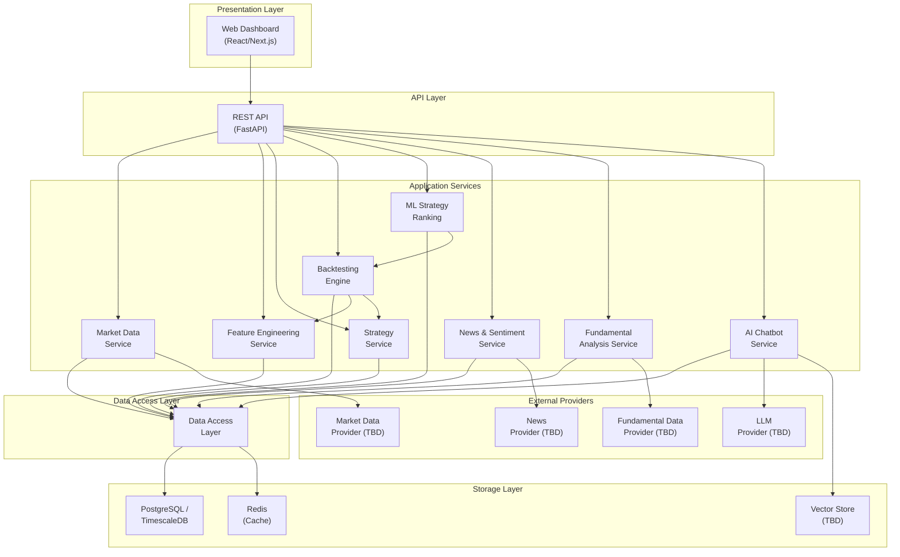
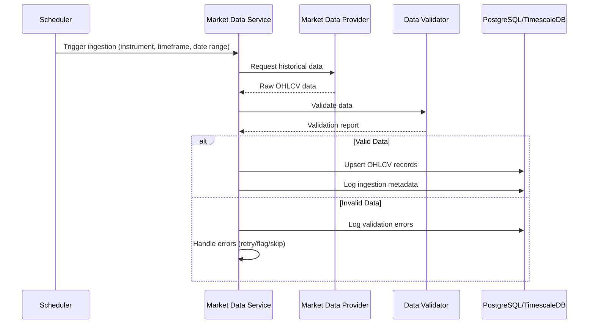
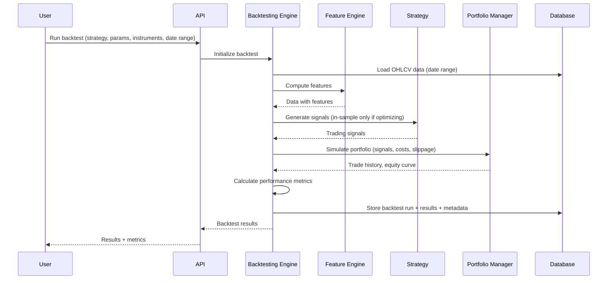
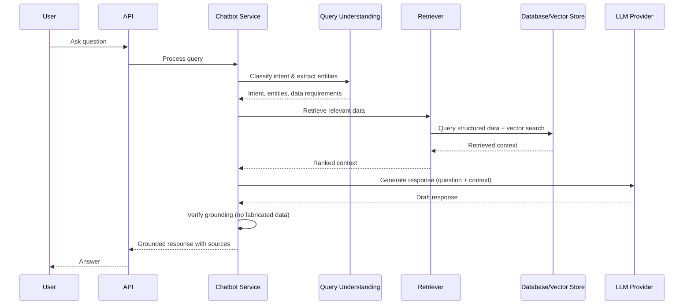

# 04 — System Design

| Field | Value |
|---|---|
| **Document ID** | SD-001 |
| **Version** | 0.1.0-draft |
| **Status** | Draft |
| **Last Updated** | 2026-08-15 |
| **Related Documents** | [Architecture](./05_ARCHITECTURE.md), [Data Architecture](./06_DATA_ARCHITECTURE.md), [PRD](./01_PRODUCT_REQUIREMENTS_DOCUMENT.md) |

---

## 1. System Overview

The platform is a layered system for quantitative research and market intelligence on Indian equities. It is designed as a **research-first** platform — the MVP is strictly research and backtesting, with no live execution.

---

## 2. Design Principles

| Principle | Description |
|---|---|
| **Provider Agnosticism** | All external providers are abstracted behind interfaces (CLIENT-CONFIRMED) |
| **Research First** | MVP is research/backtesting only; no live execution (CLIENT-CONFIRMED) |
| **Temporal Integrity** | All data access respects temporal boundaries to prevent look-ahead bias (CLIENT-CONFIRMED) |
| **Modularity** | Features, strategies, and providers are pluggable (CLIENT-CONFIRMED) |
| **Reproducibility** | All backtests must be reproducible (CLIENT-CONFIRMED) |
| **No Fabrication** | AI chatbot must never invent financial data (CLIENT-CONFIRMED) |
| **SaaS-Ready Architecture** | Design decisions should not preclude future multi-tenancy (CLIENT-CONFIRMED) |
| **MVP Minimalism** | Do not over-engineer the MVP (CLIENT-CONFIRMED) |

---

## 3. Layered Architecture

### 3.1 Presentation Layer

| Component | Technology | Responsibility |
|---|---|---|
| Web Dashboard | React/Next.js (client preference) | Interactive data visualization, strategy management, backtest results, chatbot |

### 3.2 API Layer

| Component | Technology | Responsibility |
|---|---|---|
| REST API | FastAPI (client preference) | Versioned HTTP endpoints; request validation; authentication; rate limiting |

### 3.3 Application Services Layer

| Service | Responsibility |
|---|---|
| Market Data Service | Data ingestion, validation, corporate action handling |
| Feature Engineering Service | Modular feature computation, feature registry |
| Strategy Service | Strategy management, signal generation, parameter handling |
| Backtesting Engine | Historical simulation, performance metrics, optimization |
| ML Strategy Ranking | Strategy ranking based on market conditions |
| News & Sentiment Service | News ingestion, NLP sentiment, entity recognition |
| Fundamental Analysis Service | Fundamental data ingestion, point-in-time queries |
| AI Chatbot Service | Query understanding, retrieval, grounded response generation |

### 3.4 Data Access Layer

| Component | Responsibility |
|---|---|
| Repository Pattern | Abstract database access; prevent SQL coupling in services |
| Query Builders | Temporal queries (as-of date); time-series aggregation |
| Cache Layer | Redis-backed caching for frequently accessed data |

### 3.5 Storage Layer

| Component | Technology | Use Case |
|---|---|---|
| Primary Database | PostgreSQL + TimescaleDB (client preference) | OHLCV time-series, metadata, backtest results |
| Cache | Redis (client preference, where justified) | Session cache, computed feature cache, rate limiting |
| Vector Store | TBD (pgvector recommended for MVP) | AI chatbot context retrieval |

### 3.6 External Provider Layer

| Provider Type | Status | Abstraction |
|---|---|---|
| Market Data | TBD (DhanHQ candidate) | `MarketDataProvider` interface |
| News | TBD | `NewsProvider` interface |
| Fundamental Data | TBD | `FundamentalDataProvider` interface |
| LLM | TBD | `LLMProvider` interface |
| Broker | Phase 2+ | `BrokerProvider` interface |

---

## 4. Data Flow

### 4.1 Data Ingestion Flow

### 4.2 Backtesting Flow

### 4.3 AI Chatbot Flow

---

## 5. Key Design Decisions

| Decision | Choice | Rationale | See Also |
|---|---|---|---|
| Backtesting engine type | Hybrid (vectorized + event hooks) | Balance of performance and flexibility | [ADR-006](./32_ARCHITECTURE_DECISIONS.md) |
| Database | PostgreSQL + TimescaleDB | Client preference; time-series optimization | [ADR-001](./32_ARCHITECTURE_DECISIONS.md) |
| Vector store (MVP) | pgvector (recommended) | Reduces infrastructure; sufficient at MVP scale | [ADR-005](./32_ARCHITECTURE_DECISIONS.md) |
| ML models | Start with gradient boosting | Tabular data; interpretable; fast iteration | [ADR-007](./32_ARCHITECTURE_DECISIONS.md) |
| Provider abstraction | Interface-based | Client requirement; enables provider replacement | [25_DATA_PROVIDER_ABSTRACTION.md](./25_DATA_PROVIDER_ABSTRACTION.md) |

---

## 6. Scalability Considerations (Future)

> [!NOTE]
> These are architectural notes for future SaaS evolution, not MVP requirements.

| Dimension | MVP Approach | Future Scale |
|---|---|---|
| Users | Single user (assumption) | Multi-tenant with isolation |
| Data volume | Hundreds of instruments | Thousands of instruments |
| Compute | Single-server backtesting | Distributed backtesting workers |
| Real-time | Polling / delayed data | WebSocket streaming |
| ML inference | Batch | Near-real-time |

---

## 7. Cross-References

| Document | Relevance |
|---|---|
| [Architecture](./05_ARCHITECTURE.md) | Detailed component architecture |
| [Data Architecture](./06_DATA_ARCHITECTURE.md) | Data flow and lineage |
| [Database Design](./08_DATABASE_DESIGN.md) | Schema and storage |
| [Provider Abstraction](./25_DATA_PROVIDER_ABSTRACTION.md) | External provider interfaces |
| [Deployment Architecture](./22_DEPLOYMENT_ARCHITECTURE.md) | Infrastructure and deployment |
