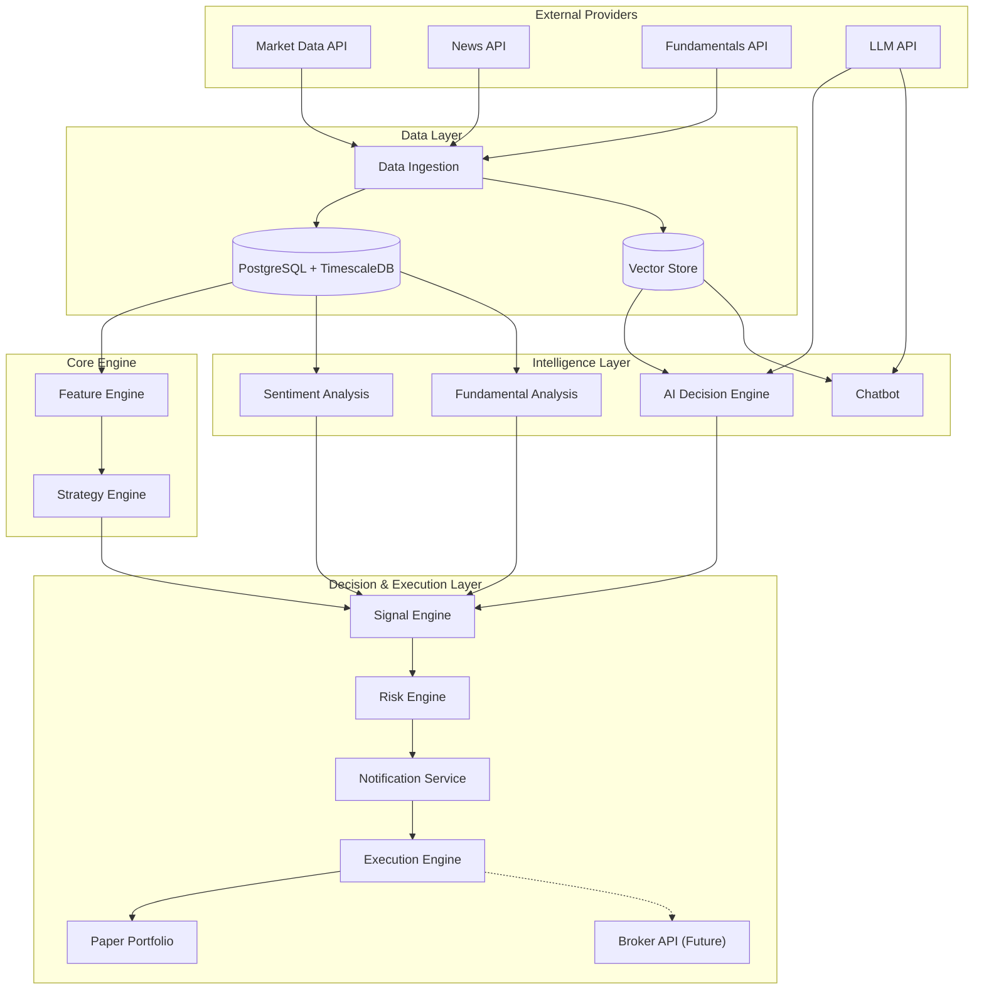

# 05 — System Architecture

| Field | Value |
|---|---|
| **Document ID** | ARCH-001 |
| **Version** | 0.2.0-draft |
| **Status** | Draft |
| **Last Updated** | 2026-08-15 |
| **Related Documents** | [System Design](./04_SYSTEM_DESIGN.md), [Data Architecture](./06_DATA_ARCHITECTURE.md), [Signal Engine](./36_SIGNAL_ENGINE.md), [Execution Engine](./37_EXECUTION_ENGINE.md) |

---

## 1. High-Level Architecture

The platform follows a modular, microservices-inspired monolithic architecture. It strictly separates data ingestion, feature computation, decision generation (strategy/AI), risk management, user approval, and execution.

---

## 2. Core Subsystems

### 2.1 Data Layer
Ingests, validates, and stores OHLCV data, news, and fundamentals. Enforces strict temporal rules (publication vs. retrieval time) to prevent look-ahead bias.

### 2.2 Feature Engine
Computes quantitative features (trend, momentum, volatility, etc.) using a plugin architecture. It provides data with strict point-in-time guarantees for both strategies and ML models.

### 2.3 Strategy Engine & Strategy Studio
Manages a registry of versioned trading strategies. Generates signals based on market data and computed features. Connects directly to the backtesting engine for historical validation.

### 2.4 Intelligence Layer
Performs NLP on news to generate sentiment scores. Processes fundamental data. The AI Decision Engine produces structured trade theses, and the AI Chatbot answers user queries based on grounded RAG context.

### 2.5 Signal Engine
The central orchestrator for trade opportunities. Supports three independent decision modes:
- **Strategy-Only:** Uses Strategy Engine output.
- **AI-Only:** Uses AI Decision Engine output.
- **Hybrid Strategy + AI:** Uses a Decision Aggregator to combine both sources into a unified opportunity.

### 2.6 Risk Engine
Evaluates every opportunity from the Signal Engine against portfolio exposure, max position sizes, and daily loss limits. Rejects unsafe trades before they reach execution.

### 2.7 Notification & Execution Layer
The Notification Service (via Telegram/Web) requests human-in-the-loop approval for risk-approved opportunities. Upon approval, the Execution Engine routes the trade to either Paper Trading (MVP) or Live Broker (Future/Gated).

### 2.8 Backtesting & ML Strategy Selection
A dedicated subsystem for historical simulation. It evaluates strategies across timeframes, feeding performance metrics into an ML Strategy Selection model that ranks strategies based on current market regimes.

---

## 3. Technology Stack

| Component | Technology | Rationale |
|---|---|---|
| **Language** | Python 3.11+ | Ecosystem for quant finance, data science, and AI |
| **Web Framework** | FastAPI | High performance, async, auto-docs (Swagger) |
| **Database (Relational)** | PostgreSQL 15+ | Client preference, robust, ACID |
| **Database (Time-Series)**| TimescaleDB | Optimized for OHLCV hyper-tables |
| **Database (Vector)** | pgvector | Reduces infrastructure complexity (MVP) |
| **Cache & Task Queue** | Redis | Fast temporary storage, task brokering |
| **Frontend** | Next.js + React | Client preference, modern UI |
| **Data Manipulation** | Pandas, NumPy | Industry standard for vectorized computation |
| **Machine Learning** | LightGBM, scikit-learn| Fast tabular data processing |
| **NLP / Sentiment** | FinBERT (or similar) | Domain-specific sentiment analysis |
| **LLM Integration** | LangChain / LlamaIndex | RAG orchestration |

---

## 4. Architectural Principles

1. **Separation of Concerns:** Data, Decision (Strategy/AI), Risk, and Execution are entirely separate layers.
2. **Provider Agnosticism:** All external data and execution providers sit behind abstract interfaces.
3. **Temporal Integrity:** The system design inherently prevents look-ahead bias and data leakage.
4. **Human-in-the-Loop:** No autonomous execution in MVP; Telegram notifications drive user approval.
5. **Execution Abstraction:** Paper trading and live execution implement the identical interface.
6. **Reproducibility:** All backtests and executed trades log exact versions of data, features, and strategies.

---

## 5. Cross-References

| Document | Relevance |
|---|---|
| [System Design](./04_SYSTEM_DESIGN.md) | High-level system goals |
| [Data Architecture](./06_DATA_ARCHITECTURE.md) | Database and ingestion details |
| [Signal Engine](./36_SIGNAL_ENGINE.md) | Decision mode architecture |
| [Execution Engine](./37_EXECUTION_ENGINE.md) | Paper and broker execution |
