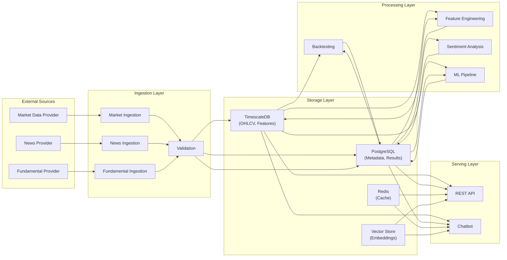

# 06 — Data Architecture

| Field | Value |
|---|---|
| **Document ID** | DA-001 |
| **Version** | 0.1.0-draft |
| **Status** | Draft |
| **Last Updated** | 2026-08-15 |
| **Related Documents** | [Database Design](./08_DATABASE_DESIGN.md), [Market Data Design](./07_MARKET_DATA_DESIGN.md), [System Design](./04_SYSTEM_DESIGN.md) |

---

## 1. Data Architecture Overview

---

## 2. Data Categories

### 2.1 Market Data (Time-Series)

| Attribute | Specification |
|---|---|
| **Type** | OHLCV (Open, High, Low, Close, Volume) |
| **Granularity** | Multiple timeframes (daily, intraday — specific intervals TBD per provider) |
| **Instruments** | Indian equities and major indices (exact universe TBD) |
| **Storage** | TimescaleDB hypertable, partitioned by time |
| **Key** | (instrument_id, timeframe, timestamp) |
| **Retention** | Configurable; full history preferred |

### 2.2 Corporate Actions

| Attribute | Specification |
|---|---|
| **Types** | Splits, dividends, bonuses, rights issues |
| **Storage** | PostgreSQL table |
| **Key** | (instrument_id, action_type, ex_date) |
| **Usage** | Price adjustment calculation; backtesting accuracy |

### 2.3 Computed Features

| Attribute | Specification |
|---|---|
| **Type** | Derived quantitative features |
| **Categories** | Trend, momentum, volatility, volume, price action, statistical, regime |
| **Storage** | TimescaleDB hypertable or computed on-the-fly (depending on cost/benefit) |
| **Key** | (instrument_id, timeframe, timestamp, feature_name) |
| **Temporal Rule** | Feature at time T computed using only data ≤ T |

### 2.4 News & Sentiment

| Attribute | Specification |
|---|---|
| **News Articles** | Title, content, source, publication_time, retrieval_time, URL |
| **Sentiment Scores** | Score per article, per instrument, per index |
| **Storage** | PostgreSQL tables |
| **Temporal Rule** | Publication time and retrieval time stored separately to prevent look-ahead bias |

### 2.5 Fundamental Data

| Attribute | Specification |
|---|---|
| **Metrics** | Revenue, earnings, EPS, P/E, P/B, ROE, debt ratios, growth |
| **Storage** | PostgreSQL table |
| **Key** | (instrument_id, metric, reporting_period, availability_date) |
| **Temporal Rule** | Point-in-time: historical queries return only data available as of query date |

### 2.6 Backtest Data

| Attribute | Specification |
|---|---|
| **Backtest Runs** | Configuration, metadata, reproducibility info |
| **Trades** | Entry/exit signals, prices, sizes, costs |
| **Metrics** | Performance metrics per run |
| **Storage** | PostgreSQL tables |

### 2.7 ML Data

| Attribute | Specification |
|---|---|
| **Models** | Model metadata, version, hyperparameters |
| **Training Runs** | Dataset info, metrics, validation results |
| **Rankings** | Strategy rankings per market condition snapshot |
| **Storage** | PostgreSQL tables; model artifacts in file storage |

### 2.8 Chat Data

| Attribute | Specification |
|---|---|
| **Sessions** | User sessions, conversation history |
| **Messages** | Questions, answers, retrieved context, sources |
| **Embeddings** | Document/data embeddings for vector search |
| **Storage** | PostgreSQL (sessions, messages); vector store (embeddings) |

---

## 3. Temporal Data Management

> [!IMPORTANT]
> Temporal integrity is critical for preventing look-ahead bias and data leakage. This is a CLIENT-CONFIRMED requirement.

### 3.1 Timestamp Types

| Timestamp Type | Description | Example |
|---|---|---|
| **Market Timestamp** | When the market event occurred | OHLCV bar close time |
| **Publication Timestamp** | When information was published | News article publication date |
| **Availability Timestamp** | When information became available in our system | Filing date of financial results; retrieval time of news |
| **Feature Timestamp** | When a feature value is valid | Feature computed from data up to this timestamp |
| **Signal Timestamp** | When a trading signal was generated | Bar close time that triggered the signal |
| **Execution Timestamp** | When an order would be executed | Next bar open (or configured execution delay) |

### 3.2 Temporal Rules

| Rule | Description |
|---|---|
| **Rule T-1** | Feature at time T must only use data with timestamps ≤ T |
| **Rule T-2** | Signal at time T must only use features with timestamps ≤ T |
| **Rule T-3** | Execution of signal at time T must occur at time > T |
| **Rule T-4** | News sentiment at time T must use only news published at time ≤ T |
| **Rule T-5** | Fundamental data at time T must use only data available at time ≤ T (point-in-time) |
| **Rule T-6** | ML training data must not include any data from the validation/test period |

### 3.3 Indian Market Time Considerations

| Aspect | Detail |
|---|---|
| **Trading Hours** | NSE: 09:15 IST — 15:30 IST |
| **Time Zone** | IST (UTC+5:30) — all timestamps stored in UTC with IST conversion |
| **Pre-Market** | 09:00 — 09:15 IST |
| **Market Holidays** | NSE holiday calendar must be maintained |
| **T+1 Settlement** | Settlement cycle affects position accounting |
| **Circuit Breakers** | Price bands and market-wide circuit breakers |

---

## 4. Data Quality Framework

### 4.1 Validation Rules

| Check | Description | Severity |
|---|---|---|
| OHLC Range | High ≥ Low; Open and Close within [Low, High] | Error |
| Volume | Volume ≥ 0; zero volume flagged as warning | Warning |
| Timestamp Gaps | Missing trading days detected | Warning |
| Duplicates | Same (instrument, timeframe, timestamp) | Error |
| Out-of-Order | Timestamps not monotonically increasing | Error |
| Price Anomalies | Price changes > configurable threshold | Warning |
| Stale Data | Data not updated beyond expected schedule | Warning |

### 4.2 Data Lineage

Every data record should be traceable to:

| Field | Purpose |
|---|---|
| `provider_id` | Which provider supplied the data |
| `ingestion_run_id` | Which ingestion batch |
| `ingested_at` | When data was ingested |
| `validated_at` | When data was validated |
| `validation_status` | Pass / warning / error |

---

## 5. Data Retention

> [!NOTE]
> **Classification: PROPOSED — Retention policy not specified by client**

| Data Type | Proposed Retention | Rationale |
|---|---|---|
| OHLCV Data | Indefinite | Historical analysis requires full history |
| Computed Features | Configurable (recomputable) | Can be regenerated from OHLCV data |
| News Articles | Indefinite | Sentiment backtesting requires history |
| Sentiment Scores | Indefinite | Time-series analysis |
| Fundamentals | Indefinite | Point-in-time analysis |
| Backtest Runs | Indefinite | Reproducibility and comparison |
| Chat History | Configurable | May have storage constraints |
| ML Models | Versioned; configurable | Model comparison and audit |

---

## 6. Data Access Patterns

| Pattern | Use Case | Optimization |
|---|---|---|
| Time-range query | Fetch OHLCV for date range | TimescaleDB hypertable; time-based partitioning |
| Point-in-time query | Fetch fundamental data as of a date | Indexed availability_date column |
| Feature computation | Fetch OHLCV with lookback window | Batch fetch with padding |
| Backtest simulation | Sequential time-series walk | Sorted time-series access |
| Sentiment aggregation | Aggregate sentiment over time windows | Pre-computed aggregations |
| Vector similarity | Find relevant context for chatbot | Vector index (pgvector / dedicated store) |

---

## 7. Cross-References

| Document | Relevance |
|---|---|
| [Database Design](./08_DATABASE_DESIGN.md) | Schema definitions |
| [Market Data Design](./07_MARKET_DATA_DESIGN.md) | Market data specifics |
| [Risk and Validation](./12_RISK_AND_VALIDATION.md) | Bias prevention rules |
| [News Sentiment Design](./14_NEWS_SENTIMENT_DESIGN.md) | Sentiment data pipeline |
| [Fundamental Analysis](./15_FUNDAMENTAL_ANALYSIS_DESIGN.md) | Fundamental data pipeline |
