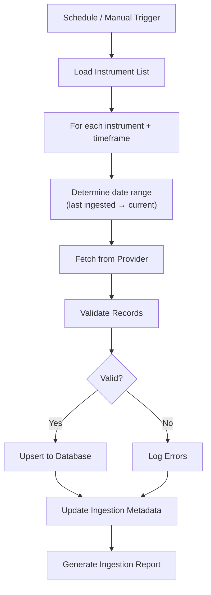

# 07 — Market Data Design

| Field | Value |
|---|---|
| **Document ID** | MDD-001 |
| **Version** | 0.1.0-draft |
| **Status** | Draft |
| **Last Updated** | 2026-08-15 |
| **Related Documents** | [Data Architecture](./06_DATA_ARCHITECTURE.md), [Provider Abstraction](./25_DATA_PROVIDER_ABSTRACTION.md), [Database Design](./08_DATABASE_DESIGN.md) |

---

## 1. Overview

The market data subsystem is responsible for ingesting, validating, storing, and serving historical and near-real-time market data for Indian equities and indices. It is the foundational data layer upon which all quantitative analysis, backtesting, and intelligence features depend.

---

## 2. Data Model

### 2.1 OHLCV Record

| Field | Type | Description |
|---|---|---|
| `instrument_id` | UUID (FK) | Reference to instruments table |
| `timeframe` | Enum | Timeframe granularity (1m, 5m, 15m, 1h, 1d, 1w, 1M) |
| `timestamp` | TIMESTAMPTZ | Bar close time in UTC |
| `open` | DECIMAL(18,4) | Opening price |
| `high` | DECIMAL(18,4) | High price |
| `low` | DECIMAL(18,4) | Low price |
| `close` | DECIMAL(18,4) | Closing price |
| `volume` | BIGINT | Trading volume |
| `provider_id` | VARCHAR | Source provider identifier |
| `ingestion_run_id` | UUID | Batch ingestion identifier |
| `ingested_at` | TIMESTAMPTZ | When record was ingested |

### 2.2 Instrument Record

| Field | Type | Description |
|---|---|---|
| `id` | UUID (PK) | Internal instrument identifier |
| `symbol` | VARCHAR | Trading symbol (e.g., "RELIANCE") |
| `name` | VARCHAR | Full instrument name |
| `exchange` | VARCHAR | Exchange code (e.g., "NSE") |
| `instrument_type` | ENUM | "equity", "index" |
| `isin` | VARCHAR | ISIN code (nullable) |
| `sector` | VARCHAR | Industry sector (nullable) |
| `provider_instrument_id` | VARCHAR | Provider's identifier |
| `is_active` | BOOLEAN | Currently listed/tradeable |
| `listed_date` | DATE | Date of listing (nullable) |
| `delisted_date` | DATE | Date of delisting (nullable) |
| `created_at` | TIMESTAMPTZ | Record creation time |
| `updated_at` | TIMESTAMPTZ | Last update time |

### 2.3 Corporate Action Record

| Field | Type | Description |
|---|---|---|
| `id` | UUID (PK) | Action identifier |
| `instrument_id` | UUID (FK) | Reference to instrument |
| `action_type` | ENUM | "split", "dividend", "bonus", "rights" |
| `ex_date` | DATE | Ex-date |
| `record_date` | DATE | Record date (nullable) |
| `details` | JSONB | Action-specific details |
| `adjustment_factor` | DECIMAL | Cumulative adjustment factor |
| `provider_id` | VARCHAR | Source provider |

---

## 3. Ingestion Pipeline

### 3.1 Pipeline Flow



### 3.2 Ingestion Modes

| Mode | Description | Use Case |
|---|---|---|
| **Full Backfill** | Ingest all available history for an instrument | Initial setup; new instrument |
| **Incremental** | Ingest from last ingested timestamp to current | Daily/regular updates |
| **Gap Fill** | Detect and fill gaps in existing data | Data quality repair |
| **Revalidation** | Re-fetch and validate existing data | Data quality audit |

### 3.3 Ingestion Configuration

```yaml
# Example ingestion configuration (conceptual)
ingestion:
  schedule: "daily"  # or cron expression
  retry:
    max_attempts: 3
    backoff_seconds: [5, 30, 120]
  batch_size: 50  # instruments per batch
  rate_limit:
    requests_per_second: null  # TBD per provider
  timeframes:
    - "1d"
    # Additional timeframes TBD
```

---

## 4. Data Validation

### 4.1 Validation Rules

| Rule ID | Rule | Action |
|---|---|---|
| V-001 | High ≥ Low | Reject record |
| V-002 | Open within [Low, High] | Reject record |
| V-003 | Close within [Low, High] | Reject record |
| V-004 | Volume ≥ 0 | Reject if negative; warn if zero |
| V-005 | Timestamp is valid trading time | Warn if outside market hours |
| V-006 | No duplicate (instrument, timeframe, timestamp) | Skip duplicate |
| V-007 | Price > 0 | Reject if ≤ 0 |
| V-008 | Price change within threshold | Warn if > configurable % change |
| V-009 | Timestamps are chronologically ordered | Reject out-of-order |
| V-010 | No gaps in trading days | Log gap warning |

### 4.2 Corporate Action Validation

| Rule | Description |
|---|---|
| Split ratio is positive | Reject invalid split ratios |
| Dividend amount is positive | Reject invalid dividend amounts |
| Ex-date is a valid trading day | Warn if on non-trading day |
| No duplicate corporate actions | Skip duplicates |

---

## 5. Corporate Action Handling

### 5.1 Adjustment Approaches

| Approach | Description | Trade-offs |
|---|---|---|
| **Store adjusted prices** | Pre-adjust all historical prices | Simple queries; data mutates on new actions |
| **Store unadjusted + adjustment factors** | Store raw prices; compute adjusted on query | Data doesn't mutate; slightly more complex queries |
| **Store both** | Store raw and adjusted | More storage; both use cases served |

**Recommended approach:** Store unadjusted prices + corporate action records + cumulative adjustment factors. Compute adjusted prices on query or during feature engineering.

### 5.2 Adjustment Types

| Type | Adjustment |
|---|---|
| **Stock Split** | Price / split_ratio; Volume × split_ratio |
| **Bonus Issue** | Price / (1 + bonus_ratio); Volume × (1 + bonus_ratio) |
| **Dividend** | Price - dividend_amount (for cash dividend adjustments) |
| **Rights Issue** | Depends on rights ratio and price |

> [!WARNING]
> Whether the data provider already delivers adjusted data varies by provider. This must be verified before implementation. See [OQ-MD-006](./33_OPEN_QUESTIONS.md).

---

## 6. Indian Market Specifics

| Aspect | Detail |
|---|---|
| **Primary Exchange** | NSE (exact universe TBD — see [OQ-IU-001](./33_OPEN_QUESTIONS.md)) |
| **Trading Hours** | 09:15 — 15:30 IST |
| **Pre-Market** | 09:00 — 09:15 IST |
| **Settlement** | T+1 |
| **Circuit Breakers** | Individual stock price bands; market-wide circuit breaker at SENSEX levels |
| **Market Holidays** | NSE holiday calendar (must be maintained yearly) |
| **Tick Size** | Varies by price level |
| **Lot Size** | Relevant for F&O; equities trade in any quantity |
| **Timestamp Zone** | IST (UTC+5:30); store as UTC internally |

---

## 7. Data Serving

### 7.1 Query Patterns

| Query | Description | Optimization |
|---|---|---|
| Range query | Get OHLCV for instrument between dates | TimescaleDB hypertable |
| Multi-instrument | Get daily closes for multiple instruments | Batch query |
| Latest bar | Get most recent bar for instrument | Index on (instrument_id, timeframe) |
| Adjusted prices | Get adjusted OHLCV | Apply adjustment factors on query |
| As-of query | Get data available as of a specific date | Filter by ingested_at ≤ as_of_date |

### 7.2 Caching Strategy

| Data | Cache Duration | Justification |
|---|---|---|
| Historical OHLCV (closed bars) | Long TTL (1h+) | Immutable once finalized |
| Latest bar | Short TTL (configurable) | May update during trading hours |
| Instrument list | Medium TTL (15min) | Rarely changes |
| Corporate actions | Long TTL (1h+) | Infrequently updated |

---

## 8. Cross-References

| Document | Relevance |
|---|---|
| [Provider Abstraction](./25_DATA_PROVIDER_ABSTRACTION.md) | MarketDataProvider interface |
| [Database Design](./08_DATABASE_DESIGN.md) | OHLCV table schema |
| [Data Architecture](./06_DATA_ARCHITECTURE.md) | Data flow context |
| [Risk and Validation](./12_RISK_AND_VALIDATION.md) | Temporal integrity rules |
| [Open Questions](./33_OPEN_QUESTIONS.md) | OQ-MD-001 through OQ-MD-006 |
