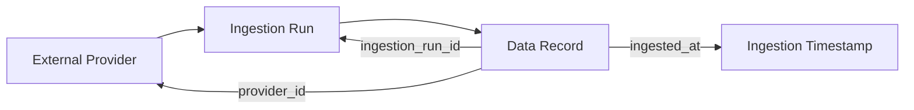

# 08 — Database Design

| Field | Value |
|---|---|
| **Document ID** | DB-001 |
| **Version** | 0.1.0-draft |
| **Status** | Draft |
| **Last Updated** | 2026-08-15 |
| **Related Documents** | [Data Architecture](./06_DATA_ARCHITECTURE.md), [Market Data Design](./07_MARKET_DATA_DESIGN.md), [ADR-001](./32_ARCHITECTURE_DECISIONS.md) |

---

## 1. Database Technology

| Component | Technology | Justification |
|---|---|---|
| **Primary DB** | PostgreSQL 15+ | Client preference; relational data |
| **Time-Series** | TimescaleDB extension | Client preference; OHLCV optimization |
| **Vector Search** | pgvector extension (recommended MVP) | Reduces infrastructure; see [ADR-005](./32_ARCHITECTURE_DECISIONS.md) |
| **Migrations** | Alembic (recommended) | Standard SQLAlchemy migration tool |

---

## 2. ER Diagram

```mermaid
erDiagram
    INSTRUMENTS ||--o{ OHLCV_DATA : has
    INSTRUMENTS ||--o{ CORPORATE_ACTIONS : has
    INSTRUMENTS ||--o{ NEWS_INSTRUMENT_MAP : "mentioned_in"
    INSTRUMENTS ||--o{ FUNDAMENTALS : has
    INSTRUMENTS ||--o{ SENTIMENT_SCORES : has

    OHLCV_DATA ||--o{ COMPUTED_FEATURES : "derived_from"

    STRATEGIES ||--o{ STRATEGY_PARAMETERS : has
    STRATEGIES ||--o{ BACKTEST_RUNS : "tested_by"

    BACKTEST_RUNS ||--o{ BACKTEST_METRICS : has
    BACKTEST_RUNS ||--o{ BACKTEST_TRADES : has
    BACKTEST_RUNS ||--o{ BACKTEST_EQUITY_CURVE : has

    NEWS_ARTICLES ||--o{ NEWS_INSTRUMENT_MAP : maps
    NEWS_ARTICLES ||--o{ SENTIMENT_SCORES : "scored_by"

    ML_MODELS ||--o{ ML_MODEL_RUNS : has
    ML_MODEL_RUNS ||--o{ ML_RANKINGS : produces

    CHAT_SESSIONS ||--o{ CHAT_MESSAGES : contains

    INGESTION_RUNS ||--o{ OHLCV_DATA : produces

    INSTRUMENTS {
        uuid id PK
        varchar symbol
        varchar name
        varchar exchange
        varchar instrument_type
        varchar isin
        varchar sector
        varchar provider_instrument_id
        boolean is_active
        date listed_date
        date delisted_date
        timestamptz created_at
        timestamptz updated_at
    }

    OHLCV_DATA {
        uuid instrument_id FK
        varchar timeframe
        timestamptz timestamp
        decimal open
        decimal high
        decimal low
        decimal close
        bigint volume
        varchar provider_id
        uuid ingestion_run_id FK
        timestamptz ingested_at
    }

    CORPORATE_ACTIONS {
        uuid id PK
        uuid instrument_id FK
        varchar action_type
        date ex_date
        date record_date
        jsonb details
        decimal adjustment_factor
        varchar provider_id
    }

    COMPUTED_FEATURES {
        uuid instrument_id FK
        varchar timeframe
        timestamptz timestamp
        varchar feature_name
        decimal feature_value
        varchar feature_version
        timestamptz computed_at
    }

    STRATEGIES {
        uuid id PK
        varchar name
        varchar family
        varchar version
        text description
        jsonb default_parameters
        boolean is_active
        timestamptz created_at
    }

    STRATEGY_PARAMETERS {
        uuid id PK
        uuid strategy_id FK
        varchar parameter_name
        varchar parameter_type
        jsonb constraints
        jsonb default_value
    }

    BACKTEST_RUNS {
        uuid id PK
        uuid strategy_id FK
        jsonb parameters
        varchar universe
        varchar timeframe
        date start_date
        date end_date
        date train_end_date
        jsonb cost_config
        jsonb metadata
        varchar status
        timestamptz created_at
        timestamptz completed_at
    }

    BACKTEST_METRICS {
        uuid id PK
        uuid backtest_run_id FK
        varchar metric_name
        decimal metric_value
        varchar period_type
    }

    BACKTEST_TRADES {
        uuid id PK
        uuid backtest_run_id FK
        uuid instrument_id FK
        varchar signal_type
        timestamptz signal_time
        timestamptz execution_time
        decimal entry_price
        decimal exit_price
        decimal quantity
        decimal pnl
        decimal commission
        decimal slippage
    }

    BACKTEST_EQUITY_CURVE {
        uuid backtest_run_id FK
        timestamptz timestamp
        decimal portfolio_value
        decimal drawdown
    }

    NEWS_ARTICLES {
        uuid id PK
        varchar article_id
        varchar title
        text content
        varchar source
        varchar url
        timestamptz publication_time
        timestamptz retrieval_time
        varchar provider_id
        jsonb raw_metadata
    }

    NEWS_INSTRUMENT_MAP {
        uuid id PK
        uuid article_id FK
        uuid instrument_id FK
        decimal relevance_score
    }

    SENTIMENT_SCORES {
        uuid id PK
        uuid article_id FK
        uuid instrument_id FK
        decimal sentiment_score
        varchar model_version
        timestamptz scored_at
    }

    FUNDAMENTALS {
        uuid id PK
        uuid instrument_id FK
        varchar metric_name
        decimal metric_value
        varchar reporting_period
        date reporting_date
        date availability_date
        varchar currency
        varchar provider_id
        timestamptz ingested_at
    }

    ML_MODELS {
        uuid id PK
        varchar model_name
        varchar model_type
        varchar version
        jsonb hyperparameters
        jsonb feature_list
        varchar artifact_path
        timestamptz created_at
    }

    ML_MODEL_RUNS {
        uuid id PK
        uuid model_id FK
        date train_start
        date train_end
        date test_start
        date test_end
        jsonb metrics
        varchar status
        timestamptz created_at
    }

    ML_RANKINGS {
        uuid id PK
        uuid model_run_id FK
        uuid strategy_id FK
        decimal rank_score
        jsonb market_features
        timestamptz ranked_at
    }

    CHAT_SESSIONS {
        uuid id PK
        varchar session_name
        timestamptz created_at
        timestamptz last_active
    }

    CHAT_MESSAGES {
        uuid id PK
        uuid session_id FK
        varchar role
        text content
        jsonb retrieved_context
        jsonb sources
        timestamptz created_at
    }

    INGESTION_RUNS {
        uuid id PK
        varchar provider_id
        varchar ingestion_type
        jsonb config
        integer records_processed
        integer records_inserted
        integer records_failed
        integer validation_warnings
        varchar status
        timestamptz started_at
        timestamptz completed_at
    }
```

---

## 3. Table Definitions

### 3.1 TimescaleDB Hypertables

The following tables should be created as TimescaleDB hypertables for time-series optimization:

| Table | Time Column | Chunk Interval (Proposed) |
|---|---|---|
| `ohlcv_data` | `timestamp` | 1 month (daily data) or 1 week (intraday) |
| `computed_features` | `timestamp` | 1 month |
| `backtest_equity_curve` | `timestamp` | 1 month |
| `sentiment_scores` | `scored_at` | 1 month |

### 3.2 Regular PostgreSQL Tables

All other tables remain as standard PostgreSQL tables.

---

## 4. Indexes

### 4.1 Primary Indexes

| Table | Index | Columns | Type |
|---|---|---|---|
| `ohlcv_data` | `idx_ohlcv_instrument_time` | (instrument_id, timeframe, timestamp) | UNIQUE |
| `instruments` | `idx_instruments_symbol_exchange` | (symbol, exchange) | UNIQUE |
| `instruments` | `idx_instruments_isin` | (isin) | INDEX (where not null) |
| `corporate_actions` | `idx_corp_actions_instrument_date` | (instrument_id, ex_date) | INDEX |
| `computed_features` | `idx_features_instrument_time` | (instrument_id, timeframe, timestamp, feature_name) | UNIQUE |
| `news_articles` | `idx_news_publication_time` | (publication_time) | INDEX |
| `news_instrument_map` | `idx_news_map_instrument` | (instrument_id) | INDEX |
| `fundamentals` | `idx_fund_instrument_metric` | (instrument_id, metric_name, reporting_period) | UNIQUE |
| `fundamentals` | `idx_fund_availability` | (instrument_id, availability_date) | INDEX |
| `backtest_runs` | `idx_bt_strategy` | (strategy_id) | INDEX |
| `backtest_trades` | `idx_bt_trades_run` | (backtest_run_id) | INDEX |
| `sentiment_scores` | `idx_sentiment_instrument` | (instrument_id, scored_at) | INDEX |
| `ml_rankings` | `idx_rankings_model_run` | (model_run_id) | INDEX |
| `chat_messages` | `idx_chat_session` | (session_id, created_at) | INDEX |

### 4.2 Vector Indexes (if pgvector is used)

| Table | Index | Column | Type |
|---|---|---|---|
| `document_embeddings` | `idx_embeddings_vector` | `embedding` | HNSW or IVFFlat |

---

## 5. Partitioning Strategy

### 5.1 TimescaleDB Automatic Partitioning

TimescaleDB hypertables automatically partition by time. Key configurations:

| Table | Chunk Interval | Compression | Retention |
|---|---|---|---|
| `ohlcv_data` | 1 month | After 6 months (proposed) | Indefinite |
| `computed_features` | 1 month | After 3 months (proposed) | Configurable |
| `backtest_equity_curve` | 1 month | After 1 month | Indefinite |

### 5.2 Manual Partitioning

Not required for MVP given expected data volumes. Consider hash partitioning by instrument_id if query patterns warrant it at scale.

---

## 6. Data Retention Strategy

> [!NOTE]
> **Classification: PROPOSED — Not specified by client**

| Data Type | Retention | Rationale |
|---|---|---|
| OHLCV data | Indefinite | Core data; required for historical analysis |
| Computed features | Configurable | Recomputable; may be purged to save space |
| Backtest results | Indefinite | Reproducibility requirement |
| News articles | Indefinite | Sentiment backtesting |
| Fundamentals | Indefinite | Point-in-time analysis |
| Chat history | 90 days (proposed) | May not need long-term retention |
| ML model artifacts | Versioned, last N versions | Model comparison |
| Ingestion logs | 30 days (proposed) | Operational debugging |

---

## 7. Data Lineage

Every record's origin is traceable through:

---

## 8. Database Access Patterns

### 8.1 Repository Layer

Each major entity has a repository class:

| Repository | Responsibility |
|---|---|
| `InstrumentRepository` | CRUD for instruments |
| `OHLCVRepository` | Time-series data access; range queries; upserts |
| `FeatureRepository` | Computed features; bulk writes |
| `StrategyRepository` | Strategy metadata and parameters |
| `BacktestRepository` | Backtest runs, metrics, trades |
| `NewsRepository` | News articles and instrument mapping |
| `SentimentRepository` | Sentiment scores |
| `FundamentalRepository` | Fundamental data with point-in-time queries |
| `MLModelRepository` | Model metadata and runs |
| `ChatRepository` | Chat sessions and messages |

### 8.2 Connection Management

| Aspect | Approach |
|---|---|
| Connection pooling | asyncpg or SQLAlchemy async with pool |
| Pool size | Configurable; start with 10 connections |
| Timeout | Configurable; 30s default |
| Health checks | Periodic connection validation |

---

## 9. Backup and Recovery

> [!NOTE]
> **Classification: PROPOSED**

| Aspect | Approach |
|---|---|
| Daily backups | pg_dump or managed backup (RDS) |
| Point-in-time recovery | WAL archiving |
| Backup retention | 30 days (proposed) |
| Recovery testing | Quarterly restore test |
| Backup storage | AWS S3 (proposed) |

---

## 10. Cross-References

| Document | Relevance |
|---|---|
| [Data Architecture](./06_DATA_ARCHITECTURE.md) | Data flow context |
| [Market Data Design](./07_MARKET_DATA_DESIGN.md) | OHLCV data specifics |
| [ADR-001](./32_ARCHITECTURE_DECISIONS.md) | Database technology decision |
| [Config & Environment](./24_CONFIG_AND_ENVIRONMENT.md) | Database credentials |
| [Deployment Architecture](./22_DEPLOYMENT_ARCHITECTURE.md) | Database deployment |
