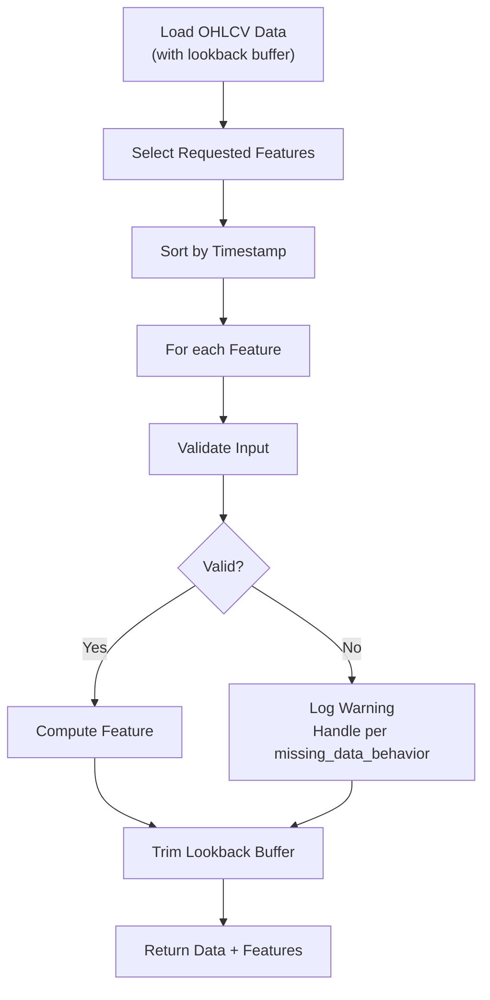

# 09 — Quantitative Feature Engineering Design

| Field | Value |
|---|---|
| **Document ID** | FE-001 |
| **Version** | 0.1.0-draft |
| **Status** | Draft |
| **Last Updated** | 2026-08-15 |
| **Related Documents** | [PRD FR-QA](./01_PRODUCT_REQUIREMENTS_DOCUMENT.md), [Data Architecture](./06_DATA_ARCHITECTURE.md), [Strategy Framework](./10_STRATEGY_FRAMEWORK.md) |

---

## 1. Design Principle

> [!IMPORTANT]
> **CLIENT-CONFIRMED:** The feature engineering framework must be modular. New features must be addable without rewriting the pipeline.

The framework uses a **plugin-style architecture** where each feature is a self-contained class implementing a standard interface. A feature registry discovers and manages all available features.

---

## 2. Feature Interface

```python
from abc import ABC, abstractmethod
from dataclasses import dataclass
from enum import Enum
from typing import List, Optional
import pandas as pd

class FeatureCategory(Enum):
    TREND = "trend"
    MOMENTUM = "momentum"
    VOLATILITY = "volatility"
    VOLUME = "volume"
    PRICE_ACTION = "price_action"
    STATISTICAL = "statistical"
    REGIME = "regime"
    FUNDAMENTAL = "fundamental"
    SENTIMENT = "sentiment"

@dataclass
class FeatureMetadata:
    name: str
    description: str
    category: FeatureCategory
    required_columns: List[str]
    lookback_period: int           # Minimum bars needed
    output_columns: List[str]
    version: str
    missing_data_behavior: str     # "drop", "fill_nan", "fill_zero", "forward_fill"

class BaseFeature(ABC):
    """Base class for all quantitative features."""

    @property
    @abstractmethod
    def metadata(self) -> FeatureMetadata:
        """Return feature metadata."""
        ...

    @abstractmethod
    def compute(self, data: pd.DataFrame) -> pd.DataFrame:
        """
        Compute the feature and return data with new columns appended.

        CRITICAL: Must only use data at or before each row's timestamp.
        No look-ahead bias is permitted.

        Args:
            data: DataFrame with at least the required_columns,
                  indexed or sorted by timestamp.

        Returns:
            DataFrame with output_columns appended.
        """
        ...

    def validate_input(self, data: pd.DataFrame) -> bool:
        """Validate that required columns exist and sufficient data is available."""
        for col in self.metadata.required_columns:
            if col not in data.columns:
                return False
        if len(data) < self.metadata.lookback_period:
            return False
        return True
```

---

## 3. Feature Registry

```python
class FeatureRegistry:
    """Central registry for discovering and managing features."""

    _features: Dict[str, Type[BaseFeature]] = {}

    @classmethod
    def register(cls, feature_class: Type[BaseFeature]):
        """Register a feature class."""
        instance = feature_class()
        cls._features[instance.metadata.name] = feature_class
        return feature_class

    @classmethod
    def get(cls, name: str) -> BaseFeature:
        """Get a feature instance by name."""
        return cls._features[name]()

    @classmethod
    def get_by_category(cls, category: FeatureCategory) -> List[BaseFeature]:
        """Get all features in a category."""
        return [
            cls._features[name]()
            for name, fc in cls._features.items()
            if fc().metadata.category == category
        ]

    @classmethod
    def list_all(cls) -> List[FeatureMetadata]:
        """List metadata for all registered features."""
        return [cls._features[name]().metadata for name in cls._features]
```

---

## 4. Feature Categories and Initial Features

### 4.1 Trend Features (CLIENT-CONFIRMED)

| Feature | Description | Required Columns | Lookback | Output Columns |
|---|---|---|---|---|
| SMA | Simple Moving Average | close | N (configurable) | `sma_{N}` |
| EMA | Exponential Moving Average | close | N | `ema_{N}` |
| MACD | MACD line, signal, histogram | close | 26 | `macd_line`, `macd_signal`, `macd_histogram` |
| ADX | Average Directional Index | high, low, close | 14 | `adx`, `plus_di`, `minus_di` |
| Supertrend | Supertrend indicator | high, low, close | 10 | `supertrend`, `supertrend_direction` |

### 4.2 Momentum Features (CLIENT-CONFIRMED)

| Feature | Description | Required Columns | Lookback | Output Columns |
|---|---|---|---|---|
| RSI | Relative Strength Index | close | 14 | `rsi_{N}` |
| Stochastic | Stochastic Oscillator | high, low, close | 14 | `stoch_k`, `stoch_d` |
| ROC | Rate of Change | close | N | `roc_{N}` |
| Williams %R | Williams %R | high, low, close | 14 | `williams_r` |
| CCI | Commodity Channel Index | high, low, close | 20 | `cci` |

### 4.3 Volatility Features (CLIENT-CONFIRMED)

| Feature | Description | Required Columns | Lookback | Output Columns |
|---|---|---|---|---|
| ATR | Average True Range | high, low, close | 14 | `atr` |
| Bollinger Bands | Bollinger Bands | close | 20 | `bb_upper`, `bb_middle`, `bb_lower`, `bb_width` |
| Historical Vol | Rolling historical volatility | close | 20 | `hist_vol_{N}` |
| Keltner Channel | Keltner Channel | high, low, close | 20 | `kc_upper`, `kc_middle`, `kc_lower` |

### 4.4 Volume Features (CLIENT-CONFIRMED)

| Feature | Description | Required Columns | Lookback | Output Columns |
|---|---|---|---|---|
| OBV | On-Balance Volume | close, volume | 1 | `obv` |
| VWAP | Volume-Weighted Avg Price | high, low, close, volume | 1 | `vwap` |
| Volume SMA | Volume Moving Average | volume | N | `vol_sma_{N}` |
| Volume Ratio | Current volume / avg volume | volume | N | `vol_ratio` |

### 4.5 Price Action Features (CLIENT-CONFIRMED)

| Feature | Description | Required Columns | Lookback | Output Columns |
|---|---|---|---|---|
| Candlestick Patterns | Common patterns (doji, hammer, engulfing, etc.) | open, high, low, close | 3 | `pattern_{name}` |
| Support/Resistance | Recent S/R levels | high, low, close | 50 | `support`, `resistance` |
| Price Change | Percentage price change | close | 1 | `pct_change` |
| Gap | Opening gap from previous close | open, close | 1 | `gap_pct` |

### 4.6 Statistical Features (CLIENT-CONFIRMED)

| Feature | Description | Required Columns | Lookback | Output Columns |
|---|---|---|---|---|
| Z-Score | Rolling z-score of returns | close | N | `zscore_{N}` |
| Skewness | Rolling skewness | close | N | `skewness_{N}` |
| Kurtosis | Rolling kurtosis | close | N | `kurtosis_{N}` |
| Hurst Exponent | Hurst exponent estimate | close | 100+ | `hurst` |
| Correlation | Rolling correlation with index | close (+ index close) | N | `corr_index_{N}` |

### 4.7 Market Regime Features (CLIENT-CONFIRMED)

| Feature | Description | Required Columns | Lookback | Output Columns |
|---|---|---|---|---|
| Trend Strength | ADX-based trend classification | high, low, close | 14 | `trend_strength` |
| Volatility Regime | Volatility percentile classification | close | 60 | `vol_regime` |
| Market Breadth | Advancing vs declining (requires universe) | close (multiple instruments) | 1 | `market_breadth` |

---

## 5. Feature Computation Pipeline

### 5.1 Pipeline Flow



### 5.2 Lookback Buffer

When computing features for a date range [start, end], the pipeline must:

1. Fetch data from [start - max_lookback_buffer, end]
2. Compute features over the full range
3. Return only data from [start, end]

This ensures feature values at the start of the range are fully computed with sufficient history.

---

## 6. Timestamp Behavior

> [!IMPORTANT]
> **CLIENT-CONFIRMED (FR-BT-006):** No future information may be available when generating a historical signal.

| Rule | Description |
|---|---|
| **Causal Computation** | Feature at time T uses only data at timestamps ≤ T |
| **No Pandas `shift(-N)` forward** | Shifting forward in time is prohibited |
| **Rolling windows look backward** | All rolling windows use past data only |
| **Feature timestamp = source data timestamp** | Features inherit the timestamp of their most recent input |

---

## 7. Missing Data Handling

| Behavior | Description | Use Case |
|---|---|---|
| `drop` | Drop rows where feature is NaN | When feature is critical for signal |
| `fill_nan` | Leave as NaN, let downstream handle | When partial features are acceptable |
| `fill_zero` | Fill NaN with 0 | When zero is a meaningful default |
| `forward_fill` | Forward-fill last valid value | When feature should persist (e.g., regime) |

---

## 8. Adding a New Feature

To add a new feature:

1. Create a new class implementing `BaseFeature`
2. Define `FeatureMetadata` with all required fields
3. Decorate with `@FeatureRegistry.register`
4. Write unit tests verifying:
   - Correct computation on known data
   - No look-ahead bias
   - Proper handling of missing data
   - Lookback period is sufficient
5. No pipeline code modifications required

---

## 9. Cross-References

| Document | Relevance |
|---|---|
| [Strategy Framework](./10_STRATEGY_FRAMEWORK.md) | Features consumed by strategies |
| [Backtesting Engine](./11_BACKTESTING_ENGINE.md) | Feature computation in backtest |
| [Risk and Validation](./12_RISK_AND_VALIDATION.md) | Look-ahead bias prevention |
| [ML Strategy Selection](./13_ML_STRATEGY_SELECTION.md) | Features as ML inputs |
| [Database Design](./08_DATABASE_DESIGN.md) | Feature storage schema |
