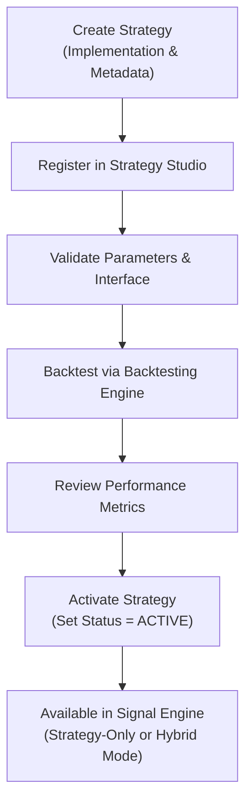

# 10 — Strategy Framework Design

| Field | Value |
|---|---|
| **Document ID** | SF-001 |
| **Version** | 0.2.0-draft |
| **Status** | Draft |
| **Last Updated** | 2026-08-15 |
| **Related Documents** | [PRD FR-SF](./01_PRODUCT_REQUIREMENTS_DOCUMENT.md), [Feature Engineering](./09_QUANT_FEATURE_ENGINEERING.md), [Backtesting Engine](./11_BACKTESTING_ENGINE.md), [Signal Engine](./36_SIGNAL_ENGINE.md) |

---

## 1. Strategy Studio & Registry

The **Strategy Studio** is a core platform capability that allows developers and users to create, register, test, save, activate, deactivate, and manage strategies. Strategies are NOT hardcoded into a single monolithic trading engine; they use a plugin-style architecture.

### 1.1 Strategy Directory Structure

```text
strategies/
├── strategy_001_momentum/
│   ├── strategy.py       # Implementation
│   ├── config.yaml       # Default configuration
│   └── metadata.json     # Registration metadata
├── strategy_002_mean_reversion/
│   └── ...
```

### 1.2 Strategy Metadata & Registration

Every strategy registers with standardized metadata (defined in `metadata.json` or as class properties):

| Metadata Field | Description |
|---|---|
| `strategy_id` | Unique identifier (e.g., "STRAT-001") |
| `name` | Human-readable name (e.g., "Momentum V2") |
| `family` | Family category (e.g., "trend_following", "momentum") |
| `version` | Semantic version (e.g., "2.0.0") |
| `author` | Creator of the strategy |
| `description` | Strategy logic description |
| `supported_timeframes` | e.g., ["5m", "15m", "1h", "1d"] |
| `market_universe` | Intended markets (e.g., "equities", "indices") |
| `required_features` | List of quantitative features needed |
| `status` | `ACTIVE`, `INACTIVE`, `ARCHIVED`, `EXPERIMENTAL` |

---

## 2. Strategy Interface

### 2.1 Base Strategy

```python
from abc import ABC, abstractmethod
from dataclasses import dataclass
from enum import Enum
from typing import Dict, List, Any, Optional
import pandas as pd

class SignalType(Enum):
    BUY = 1
    SELL = -1
    HOLD = 0

@dataclass
class StrategySignal:
    symbol: str
    timestamp: pd.Timestamp
    direction: SignalType
    strategy_id: str
    strategy_version: str
    confidence: float            # 0.0 to 1.0 (or 0-100)
    entry: Optional[float]
    stop_loss: Optional[float]
    target: Optional[float]
    position_size: Optional[float]
    reason: str
    features_used: Dict[str, float]

@dataclass
class ParameterSpec:
    name: str
    description: str
    param_type: str              # "int", "float", "str", "bool"
    default_value: Any
    min_value: Optional[Any] = None
    max_value: Optional[Any] = None
    step: Optional[Any] = None

class BaseStrategy(ABC):
    """Abstract base class for all trading strategies."""

    # Metadata properties (loaded from metadata.json or defined here)
    @property
    @abstractmethod
    def strategy_id(self) -> str: ...
    
    @property
    @abstractmethod
    def version(self) -> str: ...
    
    @property
    @abstractmethod
    def required_features(self) -> List[str]: ...

    @abstractmethod
    def get_parameter_specs(self) -> List[ParameterSpec]: ...

    @abstractmethod
    def validate_parameters(self, parameters: Dict[str, Any]) -> bool: ...

    @abstractmethod
    def generate_signals(
        self, data: pd.DataFrame, parameters: Dict[str, Any]
    ) -> List[StrategySignal]:
        """
        Generate standardized trading signals.
        Returns a list of StrategySignal objects.
        CRITICAL: Must only use data at or before each row's timestamp.
        """
        ...
        
    @abstractmethod
    def explain_signal(self, signal: StrategySignal) -> str:
        """Provide human-readable reasoning for the signal."""
        ...
```

---

## 3. Strategy Lifecycle & Workflow

Adding a new strategy follows a standardized workflow that does not require modifying core engines:



---

## 4. Strategy Activation

A strategy cannot be used for active trading generation (Paper or Live) unless it is explicitly activated in the Strategy Studio.

Available Statuses:
* `ACTIVE`: Ready for use in Signal Engine.
* `INACTIVE`: Registered but not generating live/paper signals.
* `EXPERIMENTAL`: In development; restricted to backtesting only.
* `ARCHIVED`: Deprecated; kept for historical auditability.

---

## 5. Strategy Versioning

Strategies must use strict semantic versioning. 
* Changing parameters does **not** change historical results associated with an earlier version.
* If signal logic changes, the version must be bumped.
* Backtest reproducibility requires logging the specific `strategy_version` used.

---

## 6. Strategy Families (CLIENT-CONFIRMED)

### 6.1 Trend Following
* MA Crossover (fast/slow SMA/EMA crossover)
* Supertrend
* MACD Trend

### 6.2 Momentum
* RSI Momentum
* ROC Momentum
* Stochastic Momentum

### 6.3 Mean Reversion
* Bollinger Band Reversion
* Z-Score Reversion
* RSI Mean Reversion

### 6.4 Breakout
* Donchian Breakout
* Volatility Breakout
* Volume Breakout

### 6.5 Volatility
* Volatility Regime sizing
* ATR Channel breakout

### 6.6 Statistical
* Pairs Statistical (future scope)
* Hurst-based regime trading

---

## 7. Cross-References

| Document | Relevance |
|---|---|
| [Feature Engineering](./09_QUANT_FEATURE_ENGINEERING.md) | Features consumed by strategies |
| [Backtesting Engine](./11_BACKTESTING_ENGINE.md) | Engine that backtests strategies |
| [Signal Engine](./36_SIGNAL_ENGINE.md) | Consumes signals for Strategy-Only and Hybrid modes |
| [Risk and Validation](./12_RISK_AND_VALIDATION.md) | Anti-bias rules for signal generation |
| [API Specification](./17_API_SPECIFICATION.md) | Strategy management API |
