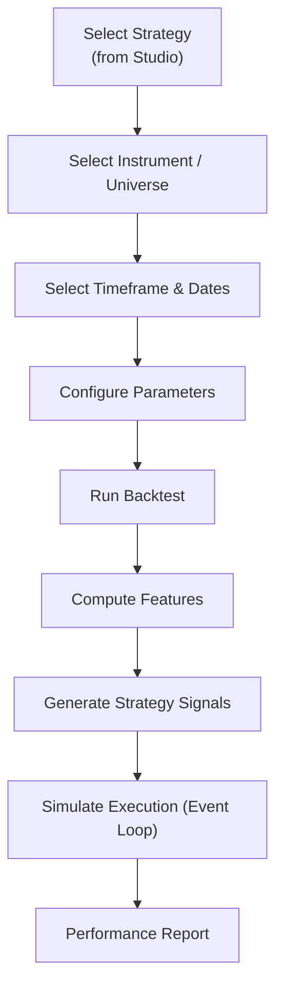

# 11 — Backtesting Engine Specification

| Field | Value |
|---|---|
| **Document ID** | BTE-001 |
| **Version** | 0.2.0-draft |
| **Status** | Draft |
| **Last Updated** | 2026-08-15 |
| **Related Documents** | [Strategy Framework](./10_STRATEGY_FRAMEWORK.md), [Risk and Validation](./12_RISK_AND_VALIDATION.md), [Execution Engine](./37_EXECUTION_ENGINE.md) |

---

## 1. Engine Purpose & Scope

The Backtesting Engine is dedicated strictly to historical simulation of strategies registered in the **Strategy Studio**. It is entirely separate from the live/paper Execution Engine, though it simulates execution logic to evaluate performance.

**Key Principle:** The backtester evaluates a strategy's historical merit. It does *not* execute paper trades, and its performance must carry disclaimers stating that backtest success does not guarantee live profitability.

---

## 2. Engine Architecture (Hybrid)

| Component | Approach | Rationale |
|---|---|---|
| **Signal Generation** | Vectorized (Pandas/NumPy) | Performance; strategies process entire DataFrames historically |
| **Order Simulation** | Event-driven loop | Complex execution logic, slippage, costs |
| **Position Management** | Event-driven | Dynamic sizing, stop-loss, take-profit |
| **Portfolio Accounting** | Event-driven | Cash tracking, margin, exposure limits |
| **Metrics Calculation** | Vectorized | Post-simulation aggregate computation |

---

## 3. Backtest Workflow (from Strategy Studio)



---

## 4. Data Model

### 4.1 Backtest Configuration

```python
@dataclass
class BacktestConfig:
    strategy_id: str
    strategy_version: str
    parameters: Dict[str, Any]
    instruments: List[str]
    timeframe: str
    start_date: date
    end_date: date
    train_end_date: Optional[date]   # For train/test split

    # Cost model
    commission_pct: float = 0.001
    slippage_pct: float = 0.0005
    additional_costs: Dict[str, float] = field(default_factory=dict)

    # Position management
    initial_capital: float = 1_000_000.0
    position_sizing: str = "equal_weight"
    
    # Execution Simulation
    execution_delay: int = 1         # Bars delay (1 = next bar open)
```

---

## 5. Performance Analytics (CLIENT-CONFIRMED)

The resulting Performance Report must include, at minimum:

| Metric | Formula/Description |
|---|---|
| **Total Return** | (Final Value - Initial Value) / Initial Value |
| **CAGR** | (Final/Initial)^(1/years) - 1 |
| **Sharpe Ratio** | Mean(excess returns) / Std(excess returns) × √252 |
| **Sortino Ratio** | Mean(excess returns) / Downside Std × √252 |
| **Maximum Drawdown** | Max peak-to-trough decline |
| **Win Rate** | Winning trades / Total trades |
| **Profit Factor** | Gross profit / Gross loss |
| **Number of Trades** | Total completed trades |
| **Average Trade Return** | Mean return per trade |
| **Risk/Reward Ratio** | Average win / Average loss |
| **Benchmark Comparison** | Alpha, beta, relative return vs benchmark index |
| **Visualizations** | Equity curve, Drawdown curve, Trade distribution |

---

## 6. Strategy Optimization

The Strategy Studio connects to the backtester for parameter optimization. 

### 6.1 Optimization Methods
* **Grid Search:** Exhaustive search over defined parameter boundaries.
* **Random Search:** For larger parameter spaces.

### 6.2 Optimization Rules (CLIENT-CONFIRMED)
* Optimization must use **proper time-series validation**.
* Do NOT optimize on the full historical dataset and present it as unbiased performance.
* Must enforce **train/test separation** and **out-of-sample testing**.
* Should support **walk-forward validation** where appropriate.

---

## 7. Execution Simulation details

| Cost Component | Default | Source |
|---|---|---|
| **Brokerage Commission** | 0.1% | Configurable |
| **Slippage** | 0.05% | Configurable |
| **STT, GST, Stamp Duty** | Standard Indian rates | Configurable |

**Temporal Rule:** A signal generated at time T is executed at time > T (default: next bar open).

---

## 8. Reproducibility & Auditability

Every backtest must record exact state to ensure reproducibility:
* `strategy_id` and `strategy_version`
* `parameter_set`
* `feature_version`
* `dataset_version`

---

## 9. Cross-References

| Document | Relevance |
|---|---|
| [Strategy Framework](./10_STRATEGY_FRAMEWORK.md) | Backtester evaluates these strategies |
| [Execution Engine](./37_EXECUTION_ENGINE.md) | Backtester simulates execution logic (not live paper trading) |
| [Risk and Validation](./12_RISK_AND_VALIDATION.md) | Train/test split rules and bias prevention |
| [MLOps & Reproducibility](./21_MLOPS_AND_REPRODUCIBILITY.md) | Metadata recording for backtests |
