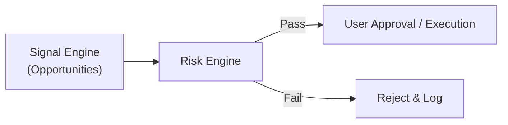

# 12 — Risk and Validation Design

| Field | Value |
|---|---|
| **Document ID** | RV-001 |
| **Version** | 0.2.0-draft |
| **Status** | Draft |
| **Last Updated** | 2026-08-15 |
| **Related Documents** | [Backtesting Engine](./11_BACKTESTING_ENGINE.md), [Execution Engine](./37_EXECUTION_ENGINE.md), [Signal Engine](./36_SIGNAL_ENGINE.md) |

---

## 1. Purpose

This document defines the safeguards and validation rules applied across the platform. It covers both **quantitative correctness** (preventing look-ahead bias, overfitting) and **operational risk management** (the dedicated Risk Engine that evaluates trade opportunities before execution).

---

## 2. Quantitative Correctness (Anti-Bias)

### 2.1 Look-Ahead Bias Prevention
* **Feature causality:** Features at time T computed using only data with timestamp ≤ T.
* **Signal causality:** Signals at time T use only features available at time ≤ T.
* **Execution delay:** Signal at T is executed at T+1 (backtesting and paper).

### 2.2 Data Leakage & Overfitting Prevention
* **Strict temporal split:** Train data ends before test data begins.
* **Feature isolation:** Rolling statistics only; no full-dataset normalization.
* **Out-of-sample validation:** Required for all parameter optimization in the Strategy Studio.

### 2.3 Survivorship Bias Prevention
* Include delisted instruments in historical database (subject to provider data availability).

### 2.4 Timestamp Alignment
* Store all timestamps in UTC.
* News sentiment uses `publication_time` for historical validation, not `retrieval_time`.
* Fundamentals use `availability_date` (when publicly filed).

---

## 3. Dedicated Risk Engine

> [!IMPORTANT]
> **CLIENT-CONFIRMED:** The Risk Engine sits strictly between the Signal Engine (Decision Layer) and the User Approval / Execution Layer. A signal that fails risk checks must NOT proceed to execution.



### 3.1 Risk Evaluation Checks

Every `TradeOpportunity` generated by the Signal Engine is evaluated against the following limits:

| Check | Description |
|---|---|
| **Maximum Position Size** | Ensures trade does not exceed max capital allocation per instrument. |
| **Portfolio Exposure** | Ensures total portfolio exposure (long/short) remains within limits. |
| **Maximum Daily Loss** | Halts new trades if realized + unrealized daily loss exceeds threshold. |
| **Stop Loss Enforcement** | Verifies that a valid stop loss is attached to the opportunity. |
| **Max Concurrent Positions** | Enforces the maximum number of simultaneous trades. |
| **Liquidity / Volume Check** | Verifies target instrument has sufficient liquidity. |
| **Duplicate Order Check** | Prevents rapid firing of identical orders for the same instrument. |
| **Stale Signal Check** | Rejects opportunities generated outside a valid time window. |
| **Market Hours Check** | Rejects execution outside valid exchange trading hours. |
| **Risk/Reward Constraint** | Rejects trades where potential loss outweighs potential gain beyond limits. |

### 3.2 Risk Engine Configuration

Risk limits are globally configurable and can be specifically overridden per-strategy or per-portfolio.

```yaml
risk_engine:
  limits:
    max_position_pct: 0.15       # Max 15% in one position
    max_daily_loss_pct: 0.05     # Stop at 5% daily loss
    max_portfolio_exposure: 1.0  # No leverage
  checks:
    require_stop_loss: true
    stale_signal_max_age_sec: 300
```

---

## 4. Execution Safety Controls

### 4.1 Paper Trading (MVP)
* Execution is simulated. While financial risk is zero, the Risk Engine behaves exactly as it would for live trading to validate the risk logic.

### 4.2 Live Trading (Future/Gated)
* **Disabled by default.**
* Requires explicit enablement and confirmation workflow.
* Must include a hardware/software **Kill Switch** to instantly halt trading and cancel pending orders.

### 4.3 Human-in-the-Loop
* For the MVP, all trades passing the Risk Engine are routed to a notification channel (Telegram) for explicit user approval before the Execution Engine processes them.

### 4.4 Disclaimer Requirement
* The system must not claim that a backtested strategy guarantees live profitability. All outputs must contain appropriate disclaimers.

---

## 5. Cross-References

| Document | Relevance |
|---|---|
| [Signal Engine](./36_SIGNAL_ENGINE.md) | Passes opportunities to the Risk Engine |
| [Execution Engine](./37_EXECUTION_ENGINE.md) | Executes trades that pass the Risk Engine and User Approval |
| [Backtesting Engine](./11_BACKTESTING_ENGINE.md) | Enforces quantitative anti-bias rules |
