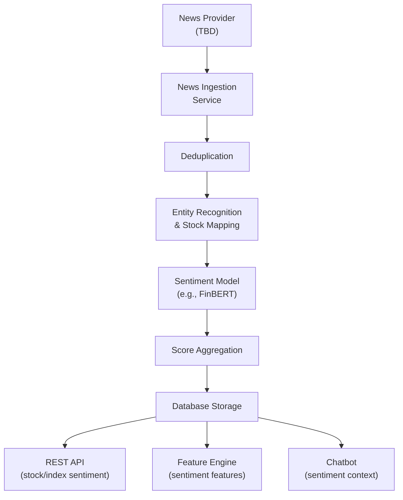

# 14 — News and Sentiment Design

| Field | Value |
|---|---|
| **Document ID** | NSD-001 |
| **Version** | 0.1.0-draft |
| **Status** | Draft |
| **Last Updated** | 2026-08-15 |
| **Related Documents** | [PRD FR-NS](./01_PRODUCT_REQUIREMENTS_DOCUMENT.md), [Provider Abstraction](./25_DATA_PROVIDER_ABSTRACTION.md), [Data Architecture](./06_DATA_ARCHITECTURE.md) |

---

## 1. Overview

The news and sentiment subsystem ingests financial news, performs NLP sentiment analysis, maps articles to instruments, and provides sentiment time series for both individual stocks and indices.

---

## 2. Architecture

---

## 3. News Ingestion

### 3.1 News Provider Interface

See [25_DATA_PROVIDER_ABSTRACTION.md](./25_DATA_PROVIDER_ABSTRACTION.md) for the `NewsProvider` interface.

> [!NOTE]
> The specific news provider is **TBD** (see [OQ-NS-001](./33_OPEN_QUESTIONS.md)). The system is designed to be provider-agnostic.

### 3.2 Ingestion Pipeline

| Step | Description |
|---|---|
| 1. Fetch | Retrieve news articles from provider API |
| 2. Parse | Extract structured fields (title, content, source, publication time) |
| 3. Deduplicate | Detect and skip duplicate articles |
| 4. Store | Persist with both publication_time and retrieval_time |
| 5. Map | Associate articles with instruments via entity recognition |
| 6. Score | Run sentiment model on article content |

### 3.3 Deduplication

| Method | Description |
|---|---|
| **URL deduplication** | Same URL → skip |
| **Title similarity** | Near-duplicate title detection (fuzzy matching) |
| **Content hash** | Hash of normalized content → detect reposts |

---

## 4. Entity Recognition and Stock Mapping

### 4.1 Entity Recognition

| Approach | Description |
|---|---|
| **Rule-based** | Match against known instrument names, symbols, and aliases |
| **NER model** | Named Entity Recognition for company names (Phase 2+ if needed) |
| **Hybrid** | Rule-based for known instruments; NER for discovery |

**MVP recommendation:** Rule-based matching against instrument database (symbol, name, aliases).

### 4.2 Stock Mapping

| Field | Description |
|---|---|
| `article_id` | Reference to news article |
| `instrument_id` | Matched instrument |
| `relevance_score` | Confidence of the mapping (0.0 to 1.0) |

### 4.3 Index Mapping

Index-level sentiment is derived from:
- Articles explicitly mentioning the index
- Aggregate of constituent instrument sentiment

---

## 5. Sentiment Model

### 5.1 Model Options

| Model | Description | Pros | Cons |
|---|---|---|---|
| **FinBERT** | Pre-trained financial sentiment | Domain-specific; proven | Requires GPU for speed |
| **VADER** | Rule-based sentiment | Fast; no GPU needed | Not financial-domain-specific |
| **Custom fine-tuned** | Fine-tuned on Indian financial news | Best accuracy | Requires labeled data |
| **API-based** | Use LLM for sentiment scoring | Easy; flexible | Cost per call; latency |

**Recommended:** FinBERT for MVP (financial domain-specific, open source). Evaluate API-based as alternative.

> [!NOTE]
> Sentiment model selection is **PROPOSED** — the client has not specified a preference (see [OQ-NS-002](./33_OPEN_QUESTIONS.md)).

### 5.2 Sentiment Score

| Field | Description |
|---|---|
| `score` | Continuous score: -1.0 (very negative) to +1.0 (very positive) |
| `label` | Categorical: "positive", "neutral", "negative" |
| `confidence` | Model confidence (0.0 to 1.0) |

---

## 6. Temporal Rules

> [!IMPORTANT]
> **CLIENT-CONFIRMED (FR-NS-008):** The system must distinguish publication time from retrieval time.

| Rule | Description |
|---|---|
| **NT-001** | News articles stored with both `publication_time` and `retrieval_time` |
| **NT-002** | Historical sentiment analysis uses `publication_time` only |
| **NT-003** | Backtesting uses `publication_time` to determine when sentiment was available |
| **NT-004** | Current/live sentiment may use `retrieval_time` for freshness |
| **NT-005** | Sentiment scores are timestamped to the article's `publication_time` |

---

## 7. Aggregation Windows

### 7.1 Sentiment Time Series (CLIENT-CONFIRMED: FR-NS-005)

| Aggregation | Description |
|---|---|
| **Daily** | Average sentiment score for the day (by publication_time) |
| **Rolling N-day** | Rolling average over N days |
| **Weighted** | Time-weighted (more recent articles weighted higher) |
| **Volume-weighted** | Articles with higher relevance_score weighted higher |

### 7.2 Index-Level Sentiment (CLIENT-CONFIRMED: FR-NS-004)

| Method | Description |
|---|---|
| **Direct** | Sentiment from articles mentioning the index directly |
| **Constituent aggregate** | Weighted average of constituent instrument sentiment |
| **Combined** | Blend of direct and constituent sentiment |

---

## 8. Sentiment as Feature (CLIENT-CONFIRMED: FR-NS-006)

Sentiment features available for strategy and ML use:

| Feature | Description | Output Column |
|---|---|---|
| Daily sentiment | Average daily sentiment score | `sentiment_daily` |
| Sentiment SMA | N-day moving average of sentiment | `sentiment_sma_{N}` |
| Sentiment change | Day-over-day sentiment change | `sentiment_change` |
| Sentiment momentum | Rate of change of sentiment | `sentiment_momentum` |
| News volume | Number of articles per day | `news_volume` |

---

## 9. Cross-References

| Document | Relevance |
|---|---|
| [Provider Abstraction](./25_DATA_PROVIDER_ABSTRACTION.md) | NewsProvider interface |
| [Database Design](./08_DATABASE_DESIGN.md) | News and sentiment tables |
| [Feature Engineering](./09_QUANT_FEATURE_ENGINEERING.md) | Sentiment features |
| [Risk and Validation](./12_RISK_AND_VALIDATION.md) | Temporal rules for backtesting |
| [AI Chatbot Design](./16_AI_RAG_CHATBOT_DESIGN.md) | Chatbot uses sentiment data |
| [Open Questions](./33_OPEN_QUESTIONS.md) | OQ-NS-001 through OQ-NS-004 |
