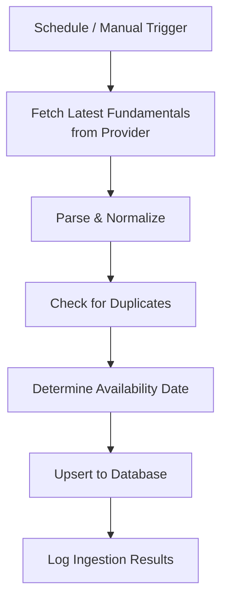

# 15 — Fundamental Analysis Design

| Field | Value |
|---|---|
| **Document ID** | FAD-001 |
| **Version** | 0.1.0-draft |
| **Status** | Draft |
| **Last Updated** | 2026-08-15 |
| **Related Documents** | [PRD FR-FA](./01_PRODUCT_REQUIREMENTS_DOCUMENT.md), [Provider Abstraction](./25_DATA_PROVIDER_ABSTRACTION.md), [Data Architecture](./06_DATA_ARCHITECTURE.md) |

---

## 1. Overview

The fundamental analysis subsystem ingests, stores, and serves company fundamental data for Indian equities. Fundamentals are critical for valuation-based analysis and must be handled as **point-in-time data** for historical backtesting (CLIENT-CONFIRMED: FR-FA-003).

---

## 2. Fundamental Metrics (CLIENT-CONFIRMED: FR-FA-001)

### 2.1 Income Statement

| Metric | Description | Unit |
|---|---|---|
| Revenue | Total revenue / net sales | Currency |
| Net Income | Net profit after tax | Currency |
| EPS | Earnings per share | Currency/share |
| EPS Growth | Year-over-year EPS growth | Percentage |

### 2.2 Valuation Ratios

| Metric | Description | Unit |
|---|---|---|
| P/E | Price-to-earnings ratio | Ratio |
| P/B | Price-to-book ratio | Ratio |
| EV/EBITDA | Enterprise value to EBITDA | Ratio |
| Dividend Yield | Annual dividend / price | Percentage |

### 2.3 Profitability

| Metric | Description | Unit |
|---|---|---|
| ROE | Return on equity | Percentage |
| ROA | Return on assets | Percentage |
| Net Margin | Net income / revenue | Percentage |
| Operating Margin | Operating income / revenue | Percentage |

### 2.4 Financial Health

| Metric | Description | Unit |
|---|---|---|
| Debt-to-Equity | Total debt / total equity | Ratio |
| Current Ratio | Current assets / current liabilities | Ratio |
| Interest Coverage | EBIT / interest expense | Ratio |

### 2.5 Growth

| Metric | Description | Unit |
|---|---|---|
| Revenue Growth | Year-over-year revenue growth | Percentage |
| Earnings Growth | Year-over-year earnings growth | Percentage |
| Book Value Growth | Year-over-year book value growth | Percentage |

---

## 3. Provider Abstraction (CLIENT-CONFIRMED: FR-FA-002)

See [25_DATA_PROVIDER_ABSTRACTION.md](./25_DATA_PROVIDER_ABSTRACTION.md) for the `FundamentalDataProvider` interface.

> [!NOTE]
> The specific fundamental data provider is **TBD** (see [OQ-FA-001](./33_OPEN_QUESTIONS.md)). The system is designed to be provider-agnostic.

---

## 4. Data Model

### 4.1 Fundamental Record

| Field | Type | Description |
|---|---|---|
| `id` | UUID (PK) | Record identifier |
| `instrument_id` | UUID (FK) | Reference to instrument |
| `metric_name` | VARCHAR | Metric identifier (e.g., "eps", "pe_ratio") |
| `metric_value` | DECIMAL | The value |
| `reporting_period` | VARCHAR | Period identifier (e.g., "Q1-FY2025", "FY2025") |
| `reporting_date` | DATE | End date of the reporting period |
| `availability_date` | DATE | When the data became publicly available |
| `currency` | VARCHAR | Currency code (e.g., "INR") |
| `provider_id` | VARCHAR | Source provider |
| `ingested_at` | TIMESTAMPTZ | When data was ingested |

### 4.2 Company Identifier Mapping

| Field | Description |
|---|---|
| `instrument_id` | Internal UUID |
| `symbol` | NSE symbol |
| `isin` | ISIN code |
| `provider_instrument_id` | Provider's identifier |
| `cin` | Corporate Identification Number (India-specific) |

---

## 5. Point-in-Time Data (CLIENT-CONFIRMED: FR-FA-003)

> [!IMPORTANT]
> Fundamentals must be handled as point-in-time data for historical backtesting.

### 5.1 Point-in-Time Query

```
At date D, return only fundamental data where availability_date ≤ D
```

This prevents look-ahead bias: at any historical date, only the fundamental data that was publicly available at that date is used.

### 5.2 Indian Reporting Calendar

| Period | Typical Filing Deadline | Typical Availability Lag |
|---|---|---|
| Q1 (Apr-Jun) | 45 days from quarter end | ~60-90 days |
| Q2 (Jul-Sep) | 45 days from quarter end | ~60-90 days |
| Q3 (Oct-Dec) | 45 days from quarter end | ~60-90 days |
| Q4 / Annual (Jan-Mar) | 60 days from year end | ~90-120 days |

### 5.3 Availability Date Handling

| Scenario | Approach |
|---|---|
| Provider supplies availability_date | Use directly |
| Provider does not supply availability_date | Estimate: reporting_date + configured lag (e.g., 75 days) |
| Availability_date unknown | Document limitation in backtest metadata |

> [!WARNING]
> Whether the data provider supplies actual filing/availability dates is **provider-dependent and must be verified** (see [OQ-FA-002](./33_OPEN_QUESTIONS.md)). If not available, the estimated lag approach introduces uncertainty in point-in-time accuracy.

---

## 6. Data Normalization

### 6.1 Currency

All monetary values stored in their original currency with currency code. Cross-currency comparison is out of MVP scope (Indian companies report in INR).

### 6.2 Reporting Period Standardization

| Format | Example | Description |
|---|---|---|
| `Q{N}-FY{YYYY}` | `Q1-FY2025` | Indian fiscal year quarter (Apr start) |
| `FY{YYYY}` | `FY2025` | Full Indian fiscal year |
| `H{N}-FY{YYYY}` | `H1-FY2025` | Half-year |

### 6.3 Missing Values

| Scenario | Handling |
|---|---|
| Metric not reported | Store as NULL; flag in data quality |
| Historical data unavailable | Document gap; do not fabricate |
| Inconsistent reporting periods | Align to closest standard period |

---

## 7. Update Pipeline



| Aspect | Detail |
|---|---|
| Update frequency | After each quarterly earnings season (assumption: quarterly; see [OQ-FA-003](./33_OPEN_QUESTIONS.md)) |
| Reconciliation | Compare with previous period; flag large changes |
| Restatements | If provider supplies restated data, store both original and restated with timestamps |

---

## 8. Fundamental Features

Fundamental metrics can be used as features in the quantitative analysis pipeline:

| Feature | Description | Category |
|---|---|---|
| P/E ratio | Latest available P/E | Fundamental |
| P/E percentile | P/E relative to historical distribution | Fundamental |
| Earnings surprise | Actual vs consensus (if available) | Fundamental |
| ROE change | Change in ROE quarter-over-quarter | Fundamental |
| Debt trend | Change in debt-to-equity | Fundamental |

> [!NOTE]
> All fundamental features in the feature engine must use the point-in-time availability date — the same temporal rules as news sentiment apply.

---

## 9. Cross-References

| Document | Relevance |
|---|---|
| [Provider Abstraction](./25_DATA_PROVIDER_ABSTRACTION.md) | FundamentalDataProvider interface |
| [Database Design](./08_DATABASE_DESIGN.md) | Fundamentals table schema |
| [Feature Engineering](./09_QUANT_FEATURE_ENGINEERING.md) | Fundamental as features |
| [Risk and Validation](./12_RISK_AND_VALIDATION.md) | Point-in-time rules |
| [AI Chatbot Design](./16_AI_RAG_CHATBOT_DESIGN.md) | Chatbot uses fundamental data |
| [Open Questions](./33_OPEN_QUESTIONS.md) | OQ-FA-001 through OQ-FA-003 |
