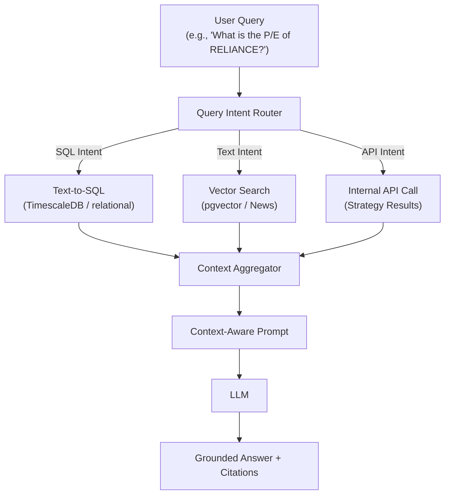

# 16 — AI Intelligence & Chatbot Design

| Field | Value |
|---|---|
| **Document ID** | AI-001 |
| **Version** | 0.2.0-draft |
| **Status** | Draft |
| **Last Updated** | 2026-08-15 |
| **Related Documents** | [Signal Engine](./36_SIGNAL_ENGINE.md), [News & Sentiment](./14_NEWS_SENTIMENT_DESIGN.md) |

---

## 1. Intelligence Layer Purpose

The AI Intelligence layer serves two distinct purposes:
1. **AI Decision Engine:** Produces structured trade theses for the Signal Engine (AI-Only and Hybrid modes).
2. **AI Chatbot:** Answers user queries about market conditions, fundamentals, and strategy performance using a conversational interface.

---

## 2. AI Decision Engine (Structured Output)

> [!IMPORTANT]
> **CLIENT-CONFIRMED:** The AI Decision Engine must produce a **structured trade thesis**, not an unstructured chatbot response. It must clearly distinguish retrieved facts, computed quantitative values, model inference, and uncertainty.

### 2.1 Workflow
1. Signal Engine requests an analysis for `Instrument X`.
2. AI Engine retrieves: Market data context, recent news/sentiment, fundamental data, current market regime.
3. LLM evaluates context against predefined trading logic prompts.
4. LLM generates a structured JSON output representing the `AIEvidence` (see Signal Engine doc).

### 2.2 Safeguards against Hallucination
* The LLM prompt explicitly commands: "If data is missing from the provided context, state 'Data Not Available'. Do not invent numbers."
* The output parser validates the structured JSON and extracts exact source citations.

---

## 3. AI Chatbot (Conversational Output)

The Chatbot is for interactive user research and Q&A.

### 3.1 Retrieval-Augmented Generation (RAG) Architecture

*RAG is the recommended architecture for grounding the AI, though not strictly mandatory if context windows support full dynamic injection.*

### 3.2 Chatbot Capabilities

| Capability | Example Query | Data Source |
|---|---|---|
| **Market Condition** | "Is NIFTY in a bullish regime?" | Computed Feature DB |
| **Fundamentals** | "Compare the P/E of TCS and INFY." | Fundamentals DB |
| **News Summary** | "Why did HDFC Bank drop yesterday?" | News DB (Vector Search) |
| **Strategy Query** | "What is the Sharpe ratio of Momentum V2?" | Backtest DB |
| **Signal Explainer** | "Why did the AI Engine signal BUY for ITC?" | Signal/Opportunity DB |

---

## 4. LLM Provider Strategy

| Provider Option | Pros | Cons |
|---|---|---|
| **OpenAI (GPT-4o)** | Best reasoning, excellent JSON structured output | Data privacy concerns, latency |
| **Anthropic (Claude 3.5)** | Strong reasoning, good coding/JSON capabilities | Data privacy concerns |
| **Self-Hosted (Llama 3)** | Complete data privacy, zero API costs | High infrastructure cost, maintenance |

*MVP Recommendation:* Use a commercial API (OpenAI/Anthropic) behind an abstraction layer, allowing easy swapping if data privacy requires moving to a self-hosted model later.

---

## 5. Security & Privacy

* Financial data (especially proprietary strategy logic) sent to external LLMs must be reviewed for IP leakage.
* Implement a local guardrail (e.g., NeMo Guardrails) to filter PII or sensitive account data from prompts before they leave the platform.

---

## 6. Cross-References

| Document | Relevance |
|---|---|
| [Signal Engine](./36_SIGNAL_ENGINE.md) | Consumes the AI Decision Engine structured output |
| [Data Provider Abstraction](./25_DATA_PROVIDER_ABSTRACTION.md) | LLM interface |
| [Database Design](./08_DATABASE_DESIGN.md) | pgvector schema |
