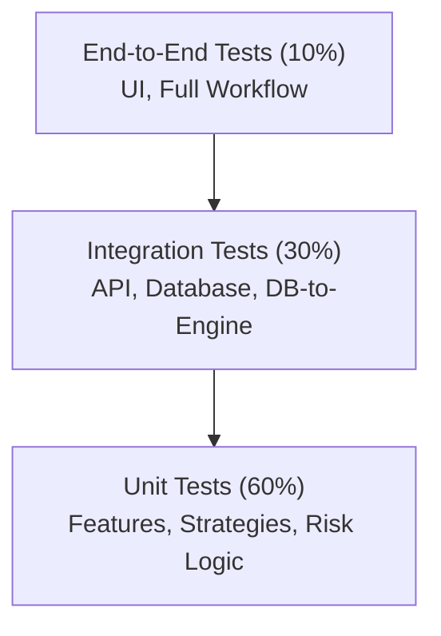

# 20 — Testing Strategy

| Field | Value |
|---|---|
| **Document ID** | TEST-001 |
| **Version** | 0.2.0-draft |
| **Status** | Draft |
| **Last Updated** | 2026-08-15 |
| **Related Documents** | [Risk and Validation](./12_RISK_AND_VALIDATION.md), [Execution Engine](./37_EXECUTION_ENGINE.md), [Signal Engine](./36_SIGNAL_ENGINE.md) |

---

## 1. Testing Pyramid

The project follows a standard testing pyramid utilizing `pytest` as the primary framework.

---

## 2. Core Validation Suites

Because financial correctness is paramount, specific validation test suites must be implemented.

### 2.1 Quantitative Correctness Suite
| Test | Description |
|---|---|
| **Temporal Leakage Test** | Ensure feature output at time T is identical whether input data ends at T or T+N. |
| **Look-Ahead Bias Test** | Ensure strategy signal at time T never changes when future bars are appended. |
| **Execution Delay Test** | Verify backtest engine and paper trading execute signals at T+1 (or later). |

### 2.2 Execution & Risk Engine Suite (New)
| Test | Description |
|---|---|
| **Risk Limit Rejection** | Verify Risk Engine blocks signals that exceed max position or max daily loss. |
| **Stale Signal Rejection** | Verify Risk Engine blocks signals older than the configurable threshold. |
| **Paper Trade Simulation** | Verify Paper Execution provider accurately fills orders based on next-bar price. |
| **Workflow State Machine** | Verify opportunity transitions correctly: Generated -> Approved -> Executed. |

### 2.3 Signal Engine Mode Suite (New)
| Test | Description |
|---|---|
| **Mode Isolation** | Verify STRATEGY_ONLY mode does not use AI logic, and vice versa. |
| **Hybrid Aggregation** | Verify Decision Aggregator correctly calculates combined scores from fixed inputs. |

### 2.4 Backtest Reproducibility Suite
| Test | Description |
|---|---|
| **Determinism Test** | Run identical backtest twice; verify output hash matches exactly. |

---

## 3. Provider Mocking

To ensure CI/CD reliability and speed, all external data providers (Market Data, News, LLM, Execution) must have robust mock implementations.

* Tests must run 100% offline using mock data providers and mock LLM responses.
* A separate "Live Integration" test suite is maintained to verify the actual provider APIs, run on a scheduled basis (not per-commit).

---

## 4. Continuous Integration (CI)

* GitHub Actions (or equivalent) triggers on every PR.
* Fails if test coverage drops below 80%.
* Fails if any Quantitative Correctness or Risk Engine test fails.
