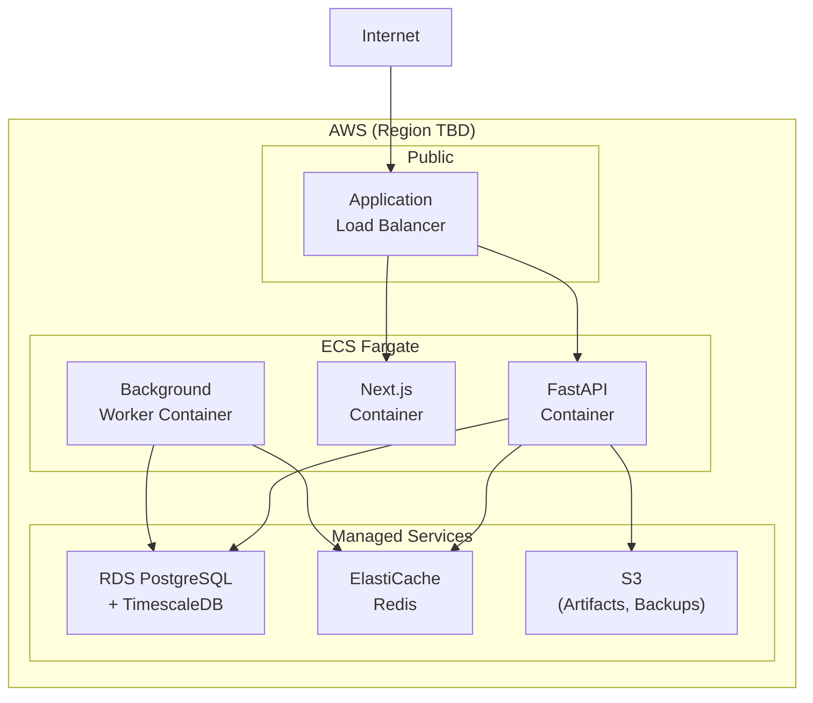
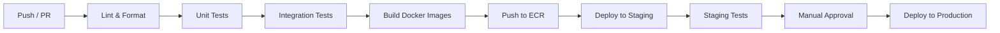

# 22 — Deployment Architecture

| Field | Value |
|---|---|
| **Document ID** | DEP-001 |
| **Version** | 0.1.0-draft |
| **Status** | Draft |
| **Last Updated** | 2026-08-15 |
| **Related Documents** | [ADR-010](./32_ARCHITECTURE_DECISIONS.md), [Architecture](./05_ARCHITECTURE.md), [Security Design](./19_SECURITY_DESIGN.md) |

---

## 1. Deployment Overview



> [!NOTE]
> **PROPOSED:** AWS deployment with ECS Fargate. Region is TBD (ap-south-1 proposed, not confirmed — see [OQ-DE-001](./33_OPEN_QUESTIONS.md)).

---

## 2. Docker Containers

### 2.1 Backend (FastAPI)

```dockerfile
# Conceptual Dockerfile structure
FROM python:3.11-slim
WORKDIR /app
COPY requirements.txt .
RUN pip install -r requirements.txt
COPY . .
CMD ["uvicorn", "api.main:app", "--host", "0.0.0.0", "--port", "8000"]
```

### 2.2 Frontend (Next.js)

```dockerfile
FROM node:20-alpine AS builder
WORKDIR /app
COPY package*.json ./
RUN npm ci
COPY . .
RUN npm run build

FROM node:20-alpine
WORKDIR /app
COPY --from=builder /app/.next ./.next
COPY --from=builder /app/node_modules ./node_modules
COPY --from=builder /app/package.json ./
CMD ["npm", "start"]
```

### 2.3 Background Worker

```dockerfile
# Same base as backend; different CMD for worker process
CMD ["python", "-m", "workers.main"]
```

---

## 3. Infrastructure Components

| Component | AWS Service | Purpose |
|---|---|---|
| **Container Orchestration** | ECS Fargate | Serverless container hosting |
| **Database** | RDS PostgreSQL | Primary database |
| **Time-Series** | TimescaleDB on RDS (to be verified) | OHLCV storage |
| **Cache** | ElastiCache Redis | Caching layer |
| **Load Balancer** | ALB | Traffic routing |
| **Object Storage** | S3 | ML artifacts, backups |
| **Secrets** | Secrets Manager | Credential storage |
| **DNS** | Route 53 | Domain management (if needed) |
| **Monitoring** | CloudWatch | Logs and metrics |
| **Container Registry** | ECR | Docker image storage |

> [!WARNING]
> **TimescaleDB on AWS RDS:** TimescaleDB availability as an RDS extension needs to be verified. Alternatives include self-managed PostgreSQL on EC2 or Timescale Cloud. See [ADR-001](./32_ARCHITECTURE_DECISIONS.md).

---

## 4. Environment Configuration

| Environment | Purpose | Scale |
|---|---|---|
| **Local** | Developer machine with Docker Compose | Single instance |
| **Staging** | Pre-production testing | Minimal Fargate tasks |
| **Production** | Live environment | Configured for expected load |

### 4.1 Docker Compose (Local Development)

```yaml
# Conceptual docker-compose structure
services:
  api:
    build: .
    ports: ["8000:8000"]
    environment:
      - DATABASE_URL=postgresql://...
      - REDIS_URL=redis://redis:6379
    depends_on: [db, redis]

  frontend:
    build: ./frontend
    ports: ["3000:3000"]
    depends_on: [api]

  db:
    image: timescale/timescaledb:latest-pg15
    ports: ["5432:5432"]
    volumes: [db-data:/var/lib/postgresql/data]

  redis:
    image: redis:7-alpine
    ports: ["6379:6379"]

volumes:
  db-data:
```

---

## 5. CI/CD Pipeline

> [!NOTE]
> **PROPOSED:** GitHub Actions. CI/CD tool preference is TBD (see [OQ-DE-004](./33_OPEN_QUESTIONS.md)).



---

## 6. Database Migrations

| Aspect | Approach |
|---|---|
| Tool | Alembic (PROPOSED) |
| Execution | Run as part of deployment pipeline |
| Rollback | Down migrations for reversible changes |
| Version tracking | Migration version stored in database |

---

## 7. Monitoring & Health Checks

| Check | Frequency | Action |
|---|---|---|
| `/health` endpoint | 30 seconds | ECS health check; restart on failure |
| Database connectivity | 60 seconds | Alert on failure |
| Redis connectivity | 60 seconds | Alert on failure; degrade gracefully |
| Provider health | 5 minutes | Alert on failure; retry |

---

## 8. Backup & Recovery

| Component | Backup Method | Frequency | Retention |
|---|---|---|---|
| PostgreSQL | RDS automated backups | Daily | 30 days (PROPOSED) |
| PostgreSQL | Manual snapshots | Before major changes | As needed |
| ML artifacts | S3 versioning | On creation | Indefinite |
| Configuration | Git repository | On change | Indefinite |

---

## 9. Cross-References

| Document | Relevance |
|---|---|
| [ADR-010](./32_ARCHITECTURE_DECISIONS.md) | Cloud architecture decision |
| [Security Design](./19_SECURITY_DESIGN.md) | Infrastructure security |
| [Monitoring](./23_MONITORING_AND_OBSERVABILITY.md) | Monitoring configuration |
| [Config & Environment](./24_CONFIG_AND_ENVIRONMENT.md) | Environment setup |
| [Open Questions](./33_OPEN_QUESTIONS.md) | Deployment-related questions |
