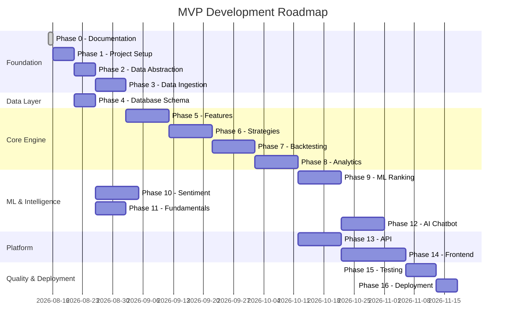

# 31 — Roadmap

| Field | Value |
|---|---|
| **Document ID** | RM-001 |
| **Version** | 0.1.0-draft |
| **Status** | Draft |
| **Last Updated** | 2026-08-15 |
| **Related Documents** | [Implementation Plan](./29_IMPLEMENTATION_PLAN.md), [MVP Scope](./03_MVP_SCOPE.md) |

---

## 1. MVP Roadmap

> [!NOTE]
> The timeline is illustrative. Actual dates depend on team size, provider selection, and client feedback. Many phases can be parallelized with a larger team.

---

## 2. Milestones

| Milestone | Description | Dependencies |
|---|---|---|
| **M1: Data Pipeline** | Historical data can be ingested, validated, and stored | Phase 1-4 |
| **M2: Feature Engine** | All feature categories implemented and tested | Phase 5 |
| **M3: Strategy Engine** | All strategy families implemented with backtest support | Phase 6-7 |
| **M4: Analytics Complete** | Full metrics, optimization, and walk-forward validation | Phase 8 |
| **M5: ML Ranking** | Strategy ranking model trained and evaluated | Phase 9 |
| **M6: Intelligence** | Sentiment, fundamentals, and chatbot operational | Phase 10-12 |
| **M7: API Complete** | All REST endpoints implemented and tested | Phase 13 |
| **M8: Dashboard** | Web dashboard functional | Phase 14 |
| **M9: MVP Complete** | All tests pass; deployment complete | Phase 15-16 |

---

## 3. Phase 2 Roadmap (Post-MVP)

| Feature | Estimated Timeline |
|---|---|
| Paper trading simulation | After MVP + 2-4 weeks |
| Live data streaming | After provider confirmation + 2-3 weeks |
| Multi-user authentication | 2-3 weeks |
| Broker integration interface | 3-4 weeks |
| Enhanced ML models | 2-3 weeks |
| Alerting system | 1-2 weeks |

---

## 4. Phase 3 Roadmap (SaaS)

| Feature | Prerequisites |
|---|---|
| Multi-tenant architecture | Phase 2 auth; database isolation design |
| Billing and subscription | Tenancy model; payment integration |
| Advanced risk management | Live trading; regulatory review |
| Mobile application | Stable API; design investment |

---

## 5. Cross-References

| Document | Relevance |
|---|---|
| [Implementation Plan](./29_IMPLEMENTATION_PLAN.md) | Detailed phase tasks |
| [MVP Scope](./03_MVP_SCOPE.md) | What's in MVP vs future |
| [Tasks](./30_TASKS.md) | Task checklist |
