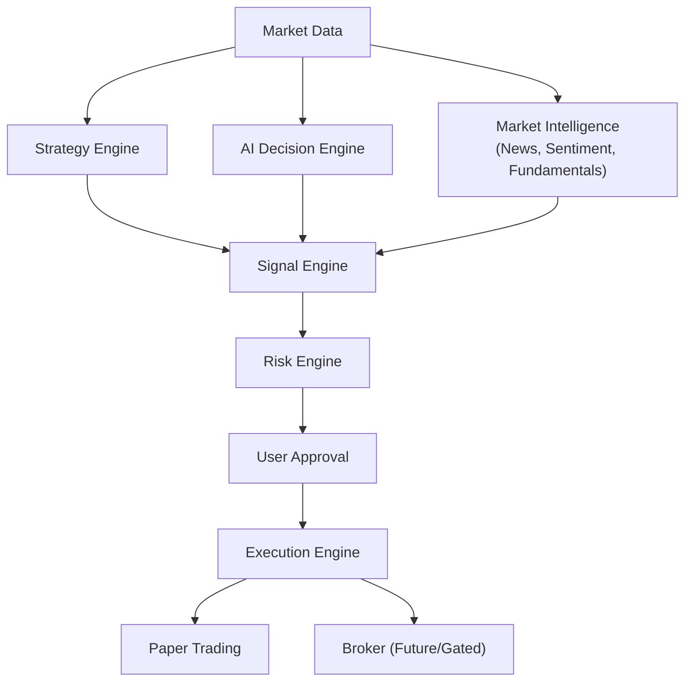
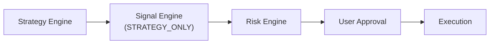
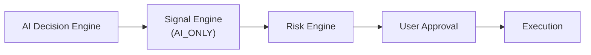
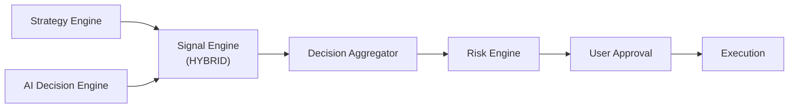
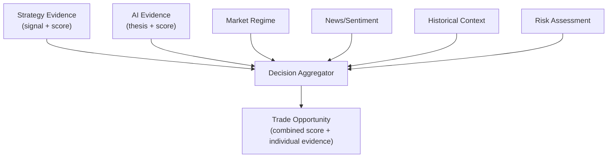

# 36 — Signal Engine & Decision Modes

| Field | Value |
|---|---|
| **Document ID** | SIG-001 |
| **Version** | 0.1.0-draft |
| **Status** | Draft |
| **Last Updated** | 2026-08-15 |
| **Related Documents** | [Architecture](./05_ARCHITECTURE.md), [Strategy Framework](./10_STRATEGY_FRAMEWORK.md), [AI Chatbot Design](./16_AI_RAG_CHATBOT_DESIGN.md), [Execution Engine](./37_EXECUTION_ENGINE.md), [Risk & Validation](./12_RISK_AND_VALIDATION.md) |

---

## 1. Purpose

> [!IMPORTANT]
> **CLIENT-CONFIRMED:** The platform must support three distinct trading decision modes that remain conceptually and technically separate: **Strategy-Only**, **AI-Only**, and **Hybrid Strategy + AI**.

The Signal Engine is the central orchestration layer that consumes outputs from the Strategy Engine, AI Decision Engine, and Market Intelligence, and produces standardized trade opportunities. It sits between the decision sources and the Risk Engine.

---

## 2. Architecture



---

## 3. Decision Modes (CLIENT-CONFIRMED)

### 3.1 Mode A — Strategy-Only

| Aspect | Description |
|---|---|
| **Source** | Selected strategy generates signals from market data + features |
| **AI role** | Informational context only (optional); AI must NOT override or alter the strategy signal |
| **Signal** | Strategy signal is the decision source |
| **Flow** | Strategy → Signal Engine → Risk Engine → User Approval → Execution |



### 3.2 Mode B — AI-Only

| Aspect | Description |
|---|---|
| **Source** | AI Decision Engine analyzes market data, features, news, sentiment, fundamentals, regime |
| **Strategy role** | No strategy is required; AI produces a structured trade thesis |
| **Signal** | AI-generated structured trade thesis (not unstructured chat) |
| **Flow** | AI Engine → Signal Engine → Risk Engine → User Approval → Execution |



### 3.3 Mode C — Hybrid Strategy + AI

| Aspect | Description |
|---|---|
| **Source** | Strategy generates signal independently; AI analyzes the same opportunity independently |
| **Combination** | Evidence from both sources is compared via a transparent Decision Aggregator |
| **Signal** | Combined opportunity with individual scores preserved |
| **Flow** | Strategy + AI Engine → Signal Engine (Hybrid) → Risk Engine → User Approval → Execution |



> [!CAUTION]
> **CLIENT-CONFIRMED:** The AI must NOT "magically confirm" a strategy. The architecture must define a transparent evidence-combination layer. Individual evidence sources must remain separately observable.

---

## 4. Decision Mode Selection (CLIENT-CONFIRMED)

Decision mode and execution mode are **independent** selections:

| Selection | Options |
|---|---|
| **Decision Mode** | `STRATEGY_ONLY`, `AI_ONLY`, `HYBRID` |
| **Execution Mode** | `BACKTEST`, `PAPER`, `LIVE` (future/gated) |

Any combination is valid:

| Decision Mode | Execution Mode | Valid |
|---|---|---|
| STRATEGY_ONLY | BACKTEST | ✅ |
| STRATEGY_ONLY | PAPER | ✅ |
| AI_ONLY | PAPER | ✅ |
| HYBRID | PAPER | ✅ |
| HYBRID | BACKTEST | ✅ |
| Any | LIVE | ✅ (future, gated) |

---

## 5. Decision / Opportunity Object (CLIENT-CONFIRMED)

Every trade opportunity produced by the Signal Engine uses a standardized structure:

```python
@dataclass
class TradeOpportunity:
    # Identity
    opportunity_id: str
    symbol: str
    instrument_id: str
    timestamp: datetime

    # Decision context
    decision_mode: DecisionMode        # STRATEGY_ONLY, AI_ONLY, HYBRID
    direction: Direction               # BUY, SELL
    confidence_score: float            # 0-100 combined score

    # Strategy evidence (present in STRATEGY_ONLY and HYBRID)
    strategy_evidence: Optional[StrategyEvidence]

    # AI evidence (present in AI_ONLY and HYBRID)
    ai_evidence: Optional[AIEvidence]

    # Market context
    market_regime: str
    news_sentiment: Optional[SentimentSummary]
    fundamental_context: Optional[FundamentalSummary]

    # Trade parameters
    suggested_entry: Optional[float]
    suggested_stop_loss: Optional[float]
    suggested_target: Optional[float]
    suggested_position_size: Optional[float]
    risk_level: str                    # LOW, MEDIUM, HIGH

    # Metadata
    reasoning: List[str]
    data_references: List[DataReference]
    expiry: Optional[datetime]
    created_at: datetime

@dataclass
class StrategyEvidence:
    strategy_id: str
    strategy_name: str
    strategy_version: str
    parameters: Dict[str, Any]
    signal_type: str                   # BUY, SELL
    signal_score: float                # 0-100
    features_used: Dict[str, float]
    explanation: str

@dataclass
class AIEvidence:
    ai_model_id: str
    ai_model_version: str
    direction: str                     # BUY, SELL
    ai_score: float                    # 0-100
    reasoning: List[str]
    retrieved_facts: List[str]
    computed_values: Dict[str, float]
    model_inference: str
    uncertainty: str
    evidence_sources: List[DataReference]

@dataclass
class DataReference:
    source_type: str                   # "market_data", "news", "fundamental", "computed"
    description: str
    timestamp: datetime
    value: Optional[str]
```

---

## 6. AI Trade Thesis (CLIENT-CONFIRMED: Mode B)

In AI-Only mode, the AI Decision Engine produces a **structured trade thesis**, not an unstructured chatbot response:

| Field | Description |
|---|---|
| Symbol | Target instrument |
| Direction | BUY or SELL |
| AI Signal Score | 0-100 confidence |
| Reasoning | Structured list of factors |
| Risk Level | LOW, MEDIUM, HIGH |
| Suggested Entry | Price or range |
| Suggested Stop | Stop-loss level |
| Suggested Target | Take-profit level |
| Evidence | Cited data sources |

> [!IMPORTANT]
> **CLIENT-CONFIRMED:** The AI must clearly distinguish retrieved facts, computed quantitative values, model inference, and uncertainty. The LLM must never invent market prices, financial metrics, news events, or backtest results.

---

## 7. Decision Aggregator (Hybrid Mode)

> [!IMPORTANT]
> **CLIENT-CONFIRMED:** Do NOT implement a simplistic "Strategy says BUY + LLM says BUY = Definitely BUY" rule.

### 7.1 Evidence Sources



### 7.2 Scoring Methodology

The MVP uses a **deterministic, configurable scoring framework**:

```yaml
# Example scoring configuration (conceptual)
hybrid_scoring:
  weights:
    strategy_signal: 0.35
    ai_signal: 0.30
    news_sentiment: 0.15
    market_regime: 0.10
    historical_context: 0.10

  agreement_bonus: 0.10    # Bonus if strategy and AI agree
  disagreement_penalty: 0.15  # Penalty if they disagree

  thresholds:
    minimum_score: 50
    high_confidence: 75

  # All weights and thresholds are configurable
```

### 7.3 Rules

| Rule | Description |
|---|---|
| Individual scores preserved | Strategy score and AI score are always separately visible |
| Agreement level | Explicitly labeled: HIGH, PARTIAL, DISAGREEMENT |
| Transparency | User sees all contributing factors and scores |
| Configurability | Weights and thresholds are configurable, not hardcoded |
| No black box | Combined score derivation is explainable |

---

## 8. Signal Engine Operations

### 8.1 Strategy-Only Flow

1. Load active strategy and parameters
2. Compute required features
3. Generate strategy signal
4. Package as `TradeOpportunity` (strategy_evidence populated, ai_evidence = None)
5. Optionally attach market context (sentiment, regime) as informational only
6. Forward to Risk Engine

### 8.2 AI-Only Flow

1. Collect market data, features, news, sentiment, fundamentals
2. Build context for AI Decision Engine
3. AI generates structured trade thesis
4. Verify grounding (no fabricated data)
5. Package as `TradeOpportunity` (ai_evidence populated, strategy_evidence = None)
6. Forward to Risk Engine

### 8.3 Hybrid Flow

1. Strategy generates signal independently (step 8.1)
2. AI analyzes the same opportunity independently (step 8.2)
3. Decision Aggregator combines evidence
4. Compute combined confidence score (preserving individual scores)
5. Label agreement level
6. Package as `TradeOpportunity` (both evidence fields populated)
7. Forward to Risk Engine

---

## 9. Auditability (CLIENT-CONFIRMED)

Every generated trade opportunity must be fully explainable after the fact. The following must be stored:

| Field | Description |
|---|---|
| Opportunity ID | Unique identifier |
| Decision mode | STRATEGY_ONLY / AI_ONLY / HYBRID |
| Strategy ID + version | Which strategy generated the signal |
| Strategy parameters | Full parameter set |
| AI model + version | Which AI model was used |
| Retrieved news/data | What data was retrieved for AI |
| Market features | Feature values at decision time |
| Risk check results | Which checks passed/failed |
| User decision | TAKE_TRADE / IGNORE |
| Execution mode | BACKTEST / PAPER / LIVE |
| Execution result | Fill details or simulation result |
| Timestamps | All timestamps for the full lifecycle |

---

## 10. Cross-References

| Document | Relevance |
|---|---|
| [Strategy Framework](./10_STRATEGY_FRAMEWORK.md) | Strategy Studio and signal generation |
| [AI Chatbot Design](./16_AI_RAG_CHATBOT_DESIGN.md) | AI Decision Engine |
| [Risk & Validation](./12_RISK_AND_VALIDATION.md) | Risk Engine |
| [Execution Engine](./37_EXECUTION_ENGINE.md) | Paper/Broker execution |
| [Notification System](./38_NOTIFICATION_SYSTEM.md) | Telegram/user approval |
| [Database Design](./08_DATABASE_DESIGN.md) | Opportunity storage |
| [API Specification](./17_API_SPECIFICATION.md) | Signal/opportunity endpoints |
