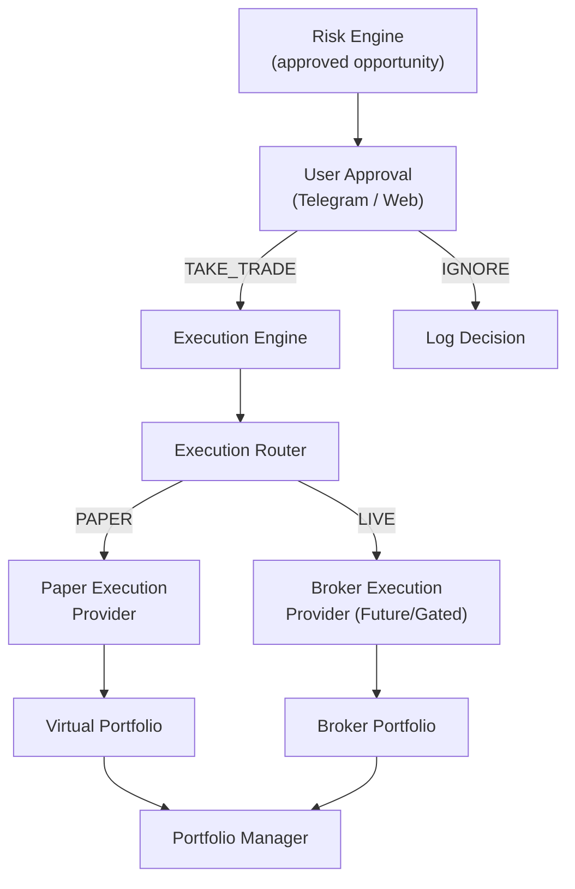
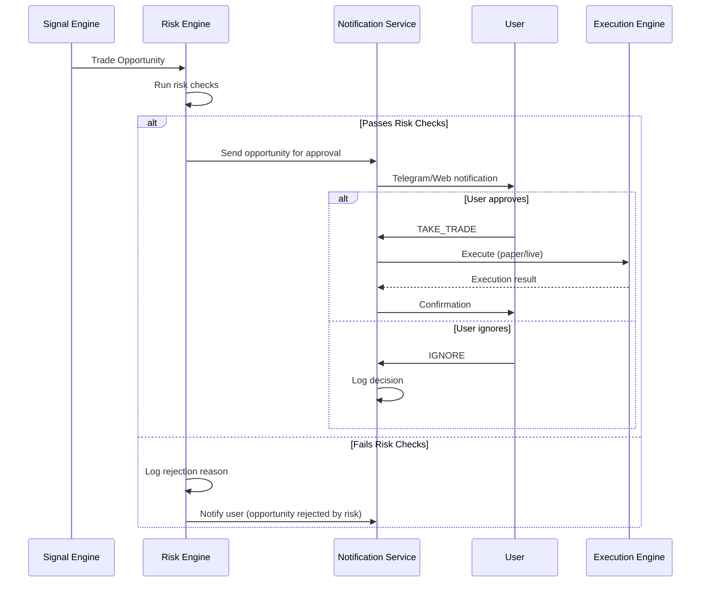
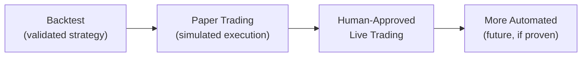

# 37 — Execution Engine & Paper Trading

| Field | Value |
|---|---|
| **Document ID** | EXE-001 |
| **Version** | 0.1.0-draft |
| **Status** | Draft |
| **Last Updated** | 2026-08-15 |
| **Related Documents** | [Signal Engine](./36_SIGNAL_ENGINE.md), [Risk & Validation](./12_RISK_AND_VALIDATION.md), [Provider Abstraction](./25_DATA_PROVIDER_ABSTRACTION.md), [Notification System](./38_NOTIFICATION_SYSTEM.md) |

---

## 1. Purpose

> [!IMPORTANT]
> **CLIENT-CONFIRMED:** Paper trading is now part of the MVP. The execution engine must abstract execution behind a common interface so that paper trading and future broker execution use the same contract.

---

## 2. Architecture



---

## 3. Execution Mode Selection (CLIENT-CONFIRMED)

| Mode | Description | MVP Status |
|---|---|---|
| `BACKTEST` | Historical simulation via backtesting engine | CLIENT-CONFIRMED MVP |
| `PAPER` | Simulated execution with virtual capital | CLIENT-CONFIRMED MVP |
| `LIVE` | Real broker execution | Future/Gated — disabled by default |

> [!CAUTION]
> **CLIENT-CONFIRMED:** Live trading must be disabled by default. It requires explicit enablement, authenticated broker account, risk checks, kill switch, position limits, daily loss limits, audit logging, and confirmation workflow.

---

## 4. Execution Provider Interface

```python
from abc import ABC, abstractmethod

class ExecutionProvider(ABC):
    """Abstract execution interface — Paper and Broker share same contract."""

    @property
    @abstractmethod
    def provider_id(self) -> str: ...

    @property
    @abstractmethod
    def execution_mode(self) -> str:
        """'paper' or 'live'"""
        ...

    @abstractmethod
    async def place_order(self, order: Order) -> OrderResult: ...

    @abstractmethod
    async def cancel_order(self, order_id: str) -> bool: ...

    @abstractmethod
    async def get_positions(self) -> List[Position]: ...

    @abstractmethod
    async def get_open_orders(self) -> List[Order]: ...

    @abstractmethod
    async def get_order_status(self, order_id: str) -> OrderStatus: ...

    @abstractmethod
    async def get_portfolio_summary(self) -> PortfolioSummary: ...

    @abstractmethod
    async def health_check(self) -> bool: ...
```

---

## 5. Paper Trading (CLIENT-CONFIRMED MVP)

### 5.1 Virtual Portfolio

| Component | Description |
|---|---|
| **Virtual Balance** | Starting capital (configurable); tracks cash |
| **Positions** | Open positions with entry price, quantity, unrealized P&L |
| **Orders** | Pending, filled, cancelled orders |
| **Trade History** | Complete record of all executed trades |
| **P&L Tracking** | Realized and unrealized profit/loss |
| **Exposure** | Current portfolio exposure |
| **Drawdown** | Running maximum drawdown calculation |

### 5.2 Paper Execution Simulation

| Aspect | Behavior |
|---|---|
| **Order fill** | Fill at next available price (configurable: market open, current price, VWAP) |
| **Slippage** | Configurable slippage model (same as backtesting) |
| **Transaction costs** | Configurable cost model (same as backtesting) |
| **Partial fills** | Not simulated in MVP |
| **Market hours** | Respect NSE trading hours; reject orders outside hours |
| **Price source** | Latest available market data from provider |

### 5.3 Paper Trading Data Model

```python
@dataclass
class Order:
    order_id: str
    opportunity_id: str            # Links to TradeOpportunity
    instrument_id: str
    direction: str                 # BUY, SELL
    order_type: str                # MARKET, LIMIT
    quantity: float
    limit_price: Optional[float]
    stop_loss: Optional[float]
    take_profit: Optional[float]
    status: OrderStatus            # PENDING, FILLED, CANCELLED, REJECTED
    created_at: datetime
    filled_at: Optional[datetime]
    fill_price: Optional[float]
    commission: Optional[float]
    slippage: Optional[float]

class OrderStatus(Enum):
    PENDING = "pending"
    FILLED = "filled"
    PARTIALLY_FILLED = "partially_filled"
    CANCELLED = "cancelled"
    REJECTED = "rejected"

@dataclass
class Position:
    instrument_id: str
    direction: str                 # LONG, SHORT
    quantity: float
    entry_price: float
    current_price: float
    unrealized_pnl: float
    opened_at: datetime
    stop_loss: Optional[float]
    take_profit: Optional[float]

@dataclass
class PortfolioSummary:
    total_value: float
    cash: float
    positions_value: float
    unrealized_pnl: float
    realized_pnl: float
    total_pnl: float
    exposure_pct: float
    drawdown: float
    max_drawdown: float
    open_positions: int
    total_trades: int
```

---

## 6. Human-in-the-Loop Approval (CLIENT-CONFIRMED)

### 6.1 Approval Workflow



### 6.2 Approval Record

Every user decision is recorded:

| Field | Description |
|---|---|
| `opportunity_id` | Which opportunity |
| `user_action` | TAKE_TRADE, IGNORE |
| `action_channel` | telegram, web |
| `action_timestamp` | When user decided |
| `execution_mode` | paper, live |
| `execution_result` | Order details or null |

---

## 7. Broker Execution (Future/Gated)

> [!NOTE]
> Broker execution is NOT part of the MVP. This section documents the interface for architectural planning.

### 7.1 Broker Provider Interface

```python
class BrokerExecutionProvider(ExecutionProvider):
    """Broker-specific execution — extends base ExecutionProvider."""

    @abstractmethod
    async def authenticate(self) -> bool: ...

    @abstractmethod
    async def get_account_info(self) -> dict: ...

    @abstractmethod
    async def get_market_depth(self, instrument_id: str) -> dict: ...
```

### 7.2 Candidate Brokers

| Broker | Status | Notes |
|---|---|---|
| DhanHQ | TBD | Mentioned by client as candidate |
| Zerodha/Kite | TBD | Popular Indian broker |
| Others | TBD | Provider-agnostic interface allows any broker |

### 7.3 Live Trading Safety Requirements (CLIENT-CONFIRMED)

| Requirement | Description |
|---|---|
| Disabled by default | `ENABLE_LIVE_TRADING = false` |
| Explicit enablement | Feature flag + configuration |
| Authenticated broker | Valid broker credentials |
| Kill switch | Immediately halt all trading |
| Position limits | Max position size per instrument |
| Daily loss limits | Stop trading on daily loss threshold |
| Order validation | Validate before submission |
| Audit logging | Log every order and action |
| Confirmation workflow | Human approval for each trade |
| Error handling | Graceful broker/API error handling |

---

## 8. Trading Transition Path (CLIENT-CONFIRMED)



> [!CAUTION]
> **CLIENT-CONFIRMED:** The documentation must NOT claim that successful backtesting guarantees live profitability.

---

## 9. Database Tables (New)

| Table | Description |
|---|---|
| `trade_opportunities` | Standardized opportunity objects |
| `opportunity_evidence` | Strategy + AI evidence per opportunity |
| `paper_orders` | Paper trading order records |
| `paper_positions` | Current paper positions |
| `paper_portfolio` | Portfolio state snapshots |
| `user_decisions` | User approval/ignore actions |

---

## 10. Cross-References

| Document | Relevance |
|---|---|
| [Signal Engine](./36_SIGNAL_ENGINE.md) | Produces opportunities for execution |
| [Risk & Validation](./12_RISK_AND_VALIDATION.md) | Risk Engine gates execution |
| [Notification System](./38_NOTIFICATION_SYSTEM.md) | User approval channel |
| [Provider Abstraction](./25_DATA_PROVIDER_ABSTRACTION.md) | Broker provider interface |
| [Database Design](./08_DATABASE_DESIGN.md) | New tables |
| [Config & Environment](./24_CONFIG_AND_ENVIRONMENT.md) | Execution mode configuration |
