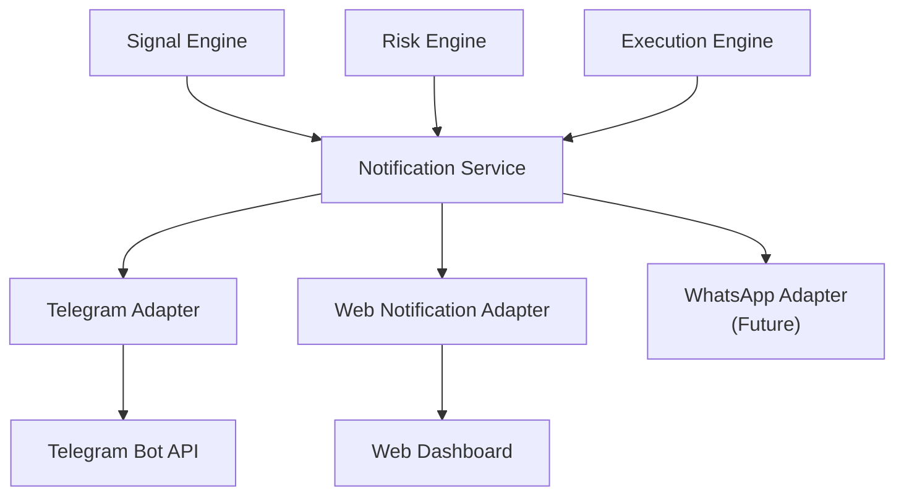
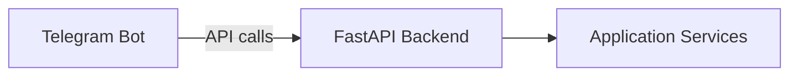

# 38 — Notification System & Telegram Integration

| Field | Value |
|---|---|
| **Document ID** | NOT-001 |
| **Version** | 0.1.0-draft |
| **Status** | Draft |
| **Last Updated** | 2026-08-15 |
| **Related Documents** | [Execution Engine](./37_EXECUTION_ENGINE.md), [Signal Engine](./36_SIGNAL_ENGINE.md), [API Specification](./17_API_SPECIFICATION.md) |

---

## 1. Purpose

> [!IMPORTANT]
> **CLIENT-CONFIRMED:** Telegram is the first notification/action channel. The Telegram bot must NOT contain trading logic — it calls the platform's API/service layer.

---

## 2. Architecture



### 2.1 Adapter Pattern

```python
class NotificationAdapter(ABC):
    """Abstract notification channel."""

    @abstractmethod
    async def send_opportunity(self, opportunity: TradeOpportunity) -> bool: ...

    @abstractmethod
    async def send_execution_result(self, result: ExecutionResult) -> bool: ...

    @abstractmethod
    async def send_alert(self, alert: Alert) -> bool: ...

    @abstractmethod
    async def send_portfolio_update(self, summary: PortfolioSummary) -> bool: ...
```

| Adapter | MVP Status | Description |
|---|---|---|
| `TelegramAdapter` | CLIENT-CONFIRMED MVP | Primary notification and action channel |
| `WebNotificationAdapter` | CLIENT-CONFIRMED MVP | Dashboard notifications |
| `WhatsAppAdapter` | Future | Future channel; architecture supports it |

---

## 3. Telegram Bot (CLIENT-CONFIRMED MVP)

### 3.1 Capabilities

| Capability | Description |
|---|---|
| **Send alerts** | Trade opportunities with full evidence |
| **Display signal info** | Strategy score, AI score, reasoning |
| **Display evidence** | Market regime, sentiment, fundamentals |
| **TAKE TRADE action** | User taps to approve trade |
| **IGNORE action** | User taps to skip |
| **Portfolio status** | Current paper positions and P&L |
| **P&L display** | Realized and unrealized P&L |
| **Safe commands** | `/status`, `/positions`, `/pnl`, `/help` |
| **Dashboard link** | Link back to web dashboard |

### 3.2 Trade Opportunity Message Format

```text
🚨 TRADE OPPORTUNITY

Symbol: RELIANCE
Decision Mode: HYBRID

📊 Strategy: Momentum V2
Strategy Signal: BUY — 84/100

🤖 AI Analysis:
AI Signal: BUY — 87/100

📰 News: Positive
📈 Market Regime: Bullish
⚠️ Risk: Medium

💰 Entry: ₹2,450
🛑 Stop Loss: ₹2,400
🎯 Target: ₹2,550

Combined Score: 86/100
Agreement: HIGH

[ ✅ TAKE PAPER TRADE ]  [ ❌ IGNORE ]
```

### 3.3 Telegram Commands

| Command | Description |
|---|---|
| `/start` | Initialize bot |
| `/status` | System health and active mode |
| `/positions` | Current open positions |
| `/pnl` | P&L summary |
| `/portfolio` | Full portfolio overview |
| `/history` | Recent trade history |
| `/mode` | Current decision + execution mode |
| `/help` | Available commands |

### 3.4 Design Principle

> [!IMPORTANT]
> **CLIENT-CONFIRMED:** The Telegram layer must NOT contain trading logic. It calls the platform's API/service layer. All decision logic, risk checks, and execution happen server-side.



---

## 4. Notification Types

| Type | Trigger | Channels |
|---|---|---|
| `TRADE_OPPORTUNITY` | Signal Engine produces opportunity that passes risk | Telegram, Web |
| `TRADE_EXECUTED` | Paper/live trade is filled | Telegram, Web |
| `TRADE_STOPPED` | Stop-loss or take-profit hit | Telegram, Web |
| `RISK_ALERT` | Risk limit approaching or breached | Telegram, Web |
| `SYSTEM_ALERT` | System health issues | Telegram, Web |
| `PORTFOLIO_UPDATE` | Periodic portfolio summary | Telegram |
| `DATA_ALERT` | Data quality issues | Web |

---

## 5. User Action Recording

Every user interaction is logged:

| Field | Description |
|---|---|
| `action_id` | Unique action identifier |
| `opportunity_id` | Which opportunity (if applicable) |
| `channel` | telegram, web |
| `action` | TAKE_TRADE, IGNORE, command |
| `timestamp` | When action occurred |
| `user_id` | User identifier |

---

## 6. WhatsApp (Future)

> [!NOTE]
> **CLIENT-CONFIRMED:** WhatsApp is a future adapter. The core platform must NOT depend on WhatsApp. The notification adapter pattern allows adding WhatsApp without modifying core logic.

---

## 7. Cross-References

| Document | Relevance |
|---|---|
| [Signal Engine](./36_SIGNAL_ENGINE.md) | Produces opportunities to notify |
| [Execution Engine](./37_EXECUTION_ENGINE.md) | Executes on user approval |
| [API Specification](./17_API_SPECIFICATION.md) | API called by Telegram bot |
| [Security Design](./19_SECURITY_DESIGN.md) | Bot authentication, user verification |
